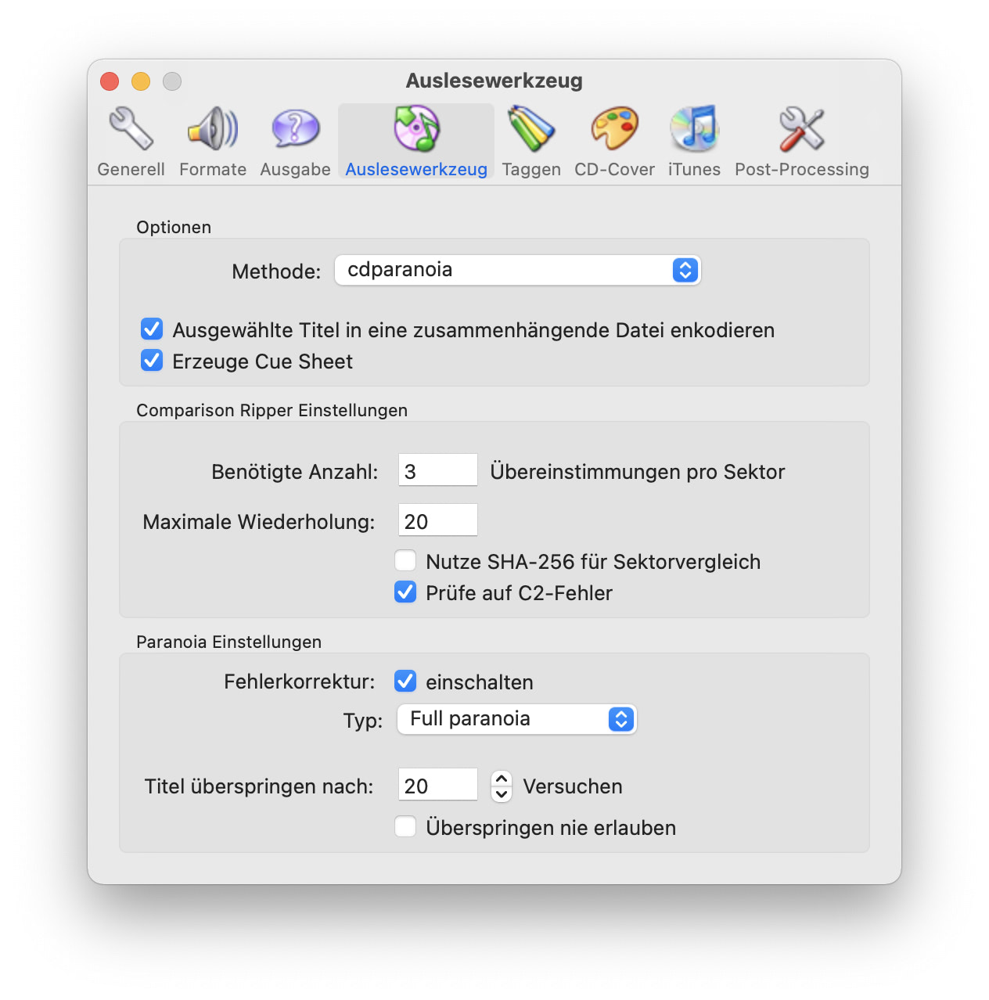

# CD-DA (Audio-CD)

&nbsp;

**Typ**  
digital, optisch

|                            | Digitalmaster       | Sichtungsfile | Sichtungsfile  alternativ |
|----------------------------|---------------------|---------------|---------------------------|
| **Codec**                  | uncompressed PCM    | MPEG-4-Audio  | MPEG-2 Audio Layer III    |
| **Auflösung bzw. Bitrate** | 16 bit              | 160 kb/s      | 256 kb/s                  |
| **Abtastrate**             | 44.1 kHz            | 44.1 kHz      | 44.1 kHz                  |
| **Kanäle**                 | original            | stereo        | stereo                    |
| **Dateiformat**            | `wav`, `cue`, `log` | `aac`         | `mp3`                     |

&nbsp;

## Workflow

### Digitalmaster

#### Windows 

Exact Audio Copy (EAC) verwenden und bestmöglich einstellen.[[&darr;]](#eac)  
------- ***todo*** -------   

Option `Kopiere Image & CUE Sheet`, unkomprimiert.  
Nach erfolgreichem Kopiervorgang, die `log`-Datei mit abspeichern.

Das Ergenbis sind drei Dateien:
1. `wav`-Datei, die den unkomprimierten, durchgehenden PCM-stream enthält (*nicht* eine `wav`-Datei je Track)
2. `cue`-Datei, die die Informationen über die Tracks, Vorlaufzeiten, etc. enthält
3. `log`-Datei mit den Informationen zum Ripping (Lesefehler etc.)

&nbsp;

#### MacOS

Max verwenden und bestmöglich einstellen.[[&darr;]](#max)  
------- ***todo*** -------  

--

Siehe auch "An Introduction to Optical Media Preservation / Appendix / CD-DA Suggested Workflow":  
https://journal.code4lib.org/articles/9581#note15 

&nbsp;

### Sichtungsfiles

------- ***todo*** -------   

&nbsp;

## Information

"Die Abbildung einer Audio CD in einem ISO-Image ist nicht möglich, weil eine Audio-CD kein ISO-9660 Dateisystem besitzt, sondern die Audiodaten direkt PCM-kodiert auf den Datenträger geschrieben sind.  
Was bei Audio-CDs umgangssprachlich "Imagedateien" genannt wird, sind brennprogrammspezifische Dateien, die zum Zwischenspeichern der Daten beim CD-Brennen gedacht sind." [[1]](#f1)  

"CD-DA was also designed to maximize space at the cost of accuracy; thus, it sacrifices a third level of error correction in exchange for more data per sector. [...] As a result, reading an audio track in a single pass will provide unreliable results, with consumer hardware being roughly 95% accurate at the track level." [[2]](#f2)

"[Exact Audio Copy] reads each sector of the disc multiple times to detect any errors. If an error is detected EAC continues to reread the disc 16 times and only considers the sector error-free if at least 8 of those 16 attempts retrieved the same data. If fewer than 8 reads match, EAC notifies the user and provides the time position of that error." [[3]](#f3)

"Every drive is unique and thus requires individual configuration. It is also prudent to align one’s drive with the AccurateRip database in order to compare individual drive accuracy against others of the same model." [[4]](#f4)   

--

<a name="f1">[1]</a>: https://kost-ceco.ch/cms/create_iso_image_de.html [↩](#i1)  
<a name="f2">[2]</a>: https://journal.code4lib.org/articles/9581#note15 CD-DA [↩](#i2)  
<a name="f3">[3]</a>: https://campuspress.yale.edu/borndigital/2016/12/20/to-image-or-copy-the-compact-disc-digital-audio-dilemma/ [↩](#i3)  
<a name="f4">[4]</a>: https://journal.code4lib.org/articles/9581#note15 Appendix / CD-DA Suggested Workflow [↩](#i4)  

&nbsp;

## Ressourcen

### CD-DA Allgemein

**Koordinationsstelle für die dauerhafte Archivierung elektronischer Unterlagen KOST**  
*Schweizerisches Bundesarchiv*  
ISO-Image von CD erstellen  
27.04.2021  
https://kost-ceco.ch/cms/create_iso_image_de.html

**Saving Digital Stuff**  
*A blog about born-digital archival collections at Yale*  
20.12.2016, Alice Prael  
https://campuspress.yale.edu/borndigital/2016/12/20/to-image-or-copy-the-compact-disc-digital-audio-dilemma/

**An Introduction to Optical Media Preservation**  
*Code4Lib Journal, Issue 24*  
16.04.2014, Alex Duryee  
https://journal.code4lib.org/articles/9581  

**An Optical Media Preservation Strategy**  
*for New York University’s Fales Library & Special Collections*  
2018, Annie Schweikert  
CD-DA: Seite 12  
https://archive.nyu.edu/bitstream/2451/43877/2/Schweikert_OpticalMediaPreservationNYU_2018.pdf

&nbsp;

### CD-DA Ripping Software 

#### Windows 

Exact Audio Copy (EAC)  
https://www.exactaudiocopy.de/en/index.php/resources/download/  

EAC Handbuch & Einstellungen  
https://wiki.hydrogenaudio.org/index.php?title=EAC_Options  

#### MacOS

Max  
https://sbooth.org/Max/  
https://formulae.brew.sh/cask/max

Rubyripper  
https://github.com/bleskodev/rubyripper

#### Linux

Linux: CD-Rippers  
https://www.tomshardware.com/reviews/ubuntu-linux-audio-software,2856-8.html

&nbsp;

## Weitere Ressourcen

**Bitsgalore**  
*digital preservation - file formats*  
Preserving optical media from the command-line (2015)  
https://www.bitsgalore.org/2015/11/13/preserving-optical-media-from-the-command-line

**Optical Media Preservation**  
[optical-media-preservation.pdf](https://raw.githubusercontent.com/wiki/orc-hfg/resources/optical-media-preservation.pdf)