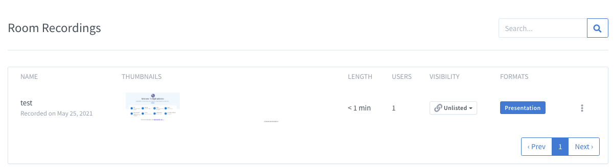
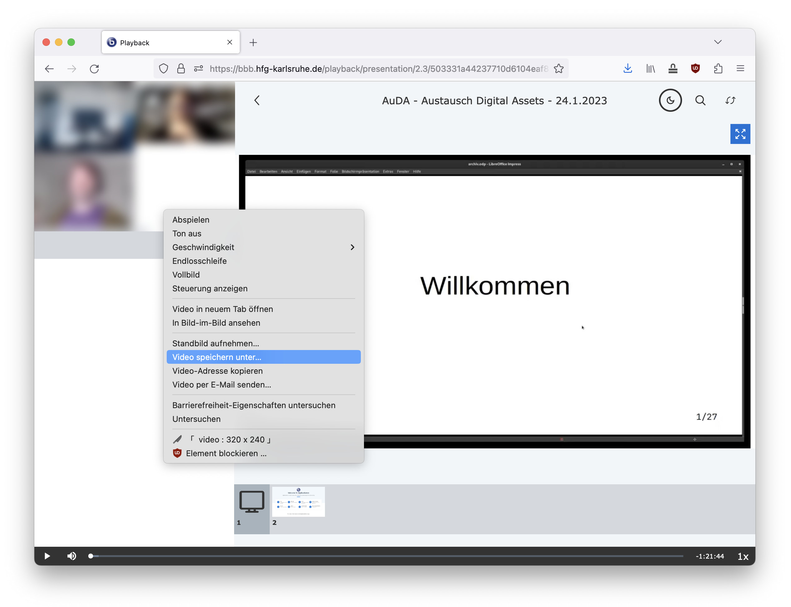
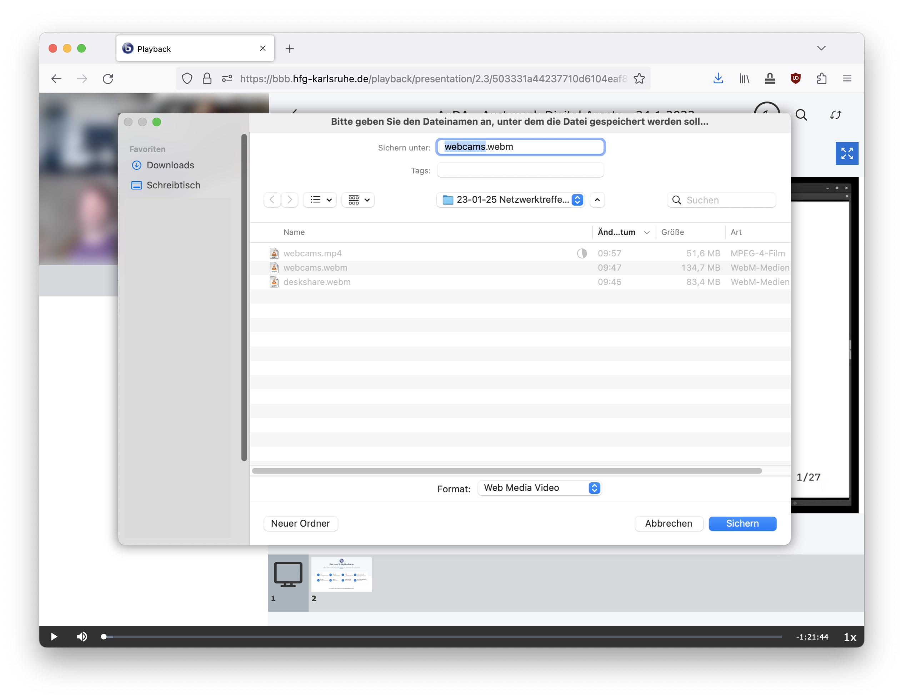

## Record a video conference 

### Important to consider:
  
There are several reasons **_not_** to record video conferences:  
  
- Data protection: you need the explicit consent of all participants every time.  
- Video files are very large. Especially for longer seminars or conferences, they become huge.  
- Recordings on the server may be deleted if the available server capacity is exceeded.  
  
Nevertheless, in some cases it may be useful to record a BBB conference.  
  
#### Consent

First and foremost, **you need to inform _all participants before recording_ and get their _explicit consent_** in order to hit the Record button. You must also state for how long and for what purpose you want to record. Beware: General Data Protection Regulation (GDPR) and other legal frameworks apply.

> _If you fail to obtain explicit permission from a single participant, **the recording must never** begin._ 

Participants do not need to explain or reason why they do not comply with recording and must not be forced to voice out such reasons under any circumstance, although they are of course welcome to do so if they find it appropriate.

### How to Record a Meeting

If you follow the above guidelines for consent, then you are allowed to record the session.

- Start a room and click on 'Start recording' at the very top
- Confirm the recording
- A counter will start of the time recorded
- Eventually, stop the recording and end the meeting
- Your recording will be available in your BBB Homepage, **but not immediately!**

BigBlueButton will immediately start working in the background to process your video and make it available to you on your BBB Home Page, but this will take time. The longer the video, the longer it will take to process; this could range from minutes to several hours and potentially even a whole day.

### Editing a recording

Once you recorded a BBB-conference you might want to share it with the participants or even publish it.

> _Always make sure that you have explicit **consent for publication** from all participiants. Otherwise the recordings must not be published._

Technically a BBB recording consists of several components:  
  
- Video(s) of the individual participants with audio track  
- Presentations  
- Public chat  
  
These components of a session are stored separately on the server. Their views can be changed individually by the participants during the course of the conference.  
  
When a recorded session is opened in BBB, these different streams are merged again at runtime. During playback, the viewers have the possibility to change the presentation (e.g. set it to full screen, hide it, etc.). This means that the conference was not stored on the server as ONE video file that could be downloaded.  
  
This leads to two possibilities for editing a recording:  
1. Download the video files individually and arrange them afterwards with an external tool (video editing).  
2. Play the recording in the browser and record your screen with a screen capturing tool.  
  
#### Pros and cons  
  
Download individually                         | Screen capture
----------------------------------------------|-----------------------------------------------------
chat not available                            | chat available
video editing tool required (and knowledge)   | screen recording tool
Videos can be freely arranged                 | live arrangement during runtime
individual post-editing possible (e.g. sound) | only post-editing of the entire recording
–                                             | Duration of screen recording = duration of recording

### Variant 1: Download video files individually  
  
When a video conference is recorded, BBB stores two individual videos on the server:    
- webcams  
- presentation  
  
These videos must be downloaded and merged (edited) using a video editing tool.  
  
> _The chat history cannot be downloaded. It is not available when using this method. If you need the chat history to be part of the recording, please use method 2._
  
#### Download videos from the BBB server  
  
The BBB recording can be accessed in the browser via the start page of the room in which the video conference took place.  
  
The recording consists of two windows that can be played simultaneously (→ Play button). Webcams and presentation are individual video files.  
  
For this method we have to download the two video files individually. First, move the mouse over the webcam video. With a right click in the browser ( Firefox in this case) a menu appears. Click `Save video as...`.  

Choose a folder where you want to save the video file.

Repeat this process for the second video: Move the mouse over the presentation video, right-click and select `Save video as...`.  
  
After a successful download, you have saved both videos on your hard disk. In the next step you can import them into the video editing tool of your choice and arrange them.  
  
### Variant 2: Screen recording  
  
As described above, the individual streams can be arranged in the browser while the recording is running. Therefore, screen-recording should only be done with someone present who will follow the conference attentively and, during the course of the recording, zoom in on the presentation when it should be in the foreground, etc.  
  
Here are some screen-recording tools that you can use in different platforms.   

##### OBS Studio (Open Broadcaster Software)

We recommend OBS Studio, a free and open source software that works on all computer operating systems: Windows, Mac, Linux, FreeBSD. It is feature-rich and has both a good knowledge base and an active community to help you learn to use it in depth. You can download it from their webpage, https://obsproject.com/.

If you want a _quick fix_, a simpler tool that “just works”, below are some alternatives for each platform.

##### Linux

Kazam: streamlined and extremely simple to use, it is available through [Launchpad](https://launchpad.net/kazam). Here you can find a simple, [step-by-step guide](https://itsfoss.com/kazam-screen-recorder/) for installing and using it in Ubuntu.

##### Mac

The simplest way is to use the built-in application Quicktime Player:

- Launch Quicktime
- Select `New Screen Recording` under the `File` menu.
- Select which area of the screen to record.
- Configure other options (audio, mouse clicks, etc.)
- Hit `Record`
    
##### Windows

Windows 10 has a built-in recording feature but it is a bit hidden. It is built into the 'Game Bar' application. [Here you can find a guide](https://www.pcmag.com/how-to/how-to-capture-video-clips-in-windows-10) on how to open, configure and use it. [Camtasia](https://www.techsmith.com/video-editor.html) and [Bandicamp](https://www.bandicam.com/) are other popular options.

##### Mobile Devices (Android, iOS)

Modern versions of both iOS and Android have built-in screen recording capabilities. If you have Android 11 or over, have a look at the [official Google documentation](https://support.google.com/android/answer/9075928?hl=en). If you have iOS 13 or over, have at the [official Apple documentation](https://support.apple.com/en-us/HT207935).

For earlier versions of Android, popular apps available via the Google Play Store are "InShot" and "AZ Screen Recorder". For earlier versions of iOS, popular apps available via the App Store are "Record it!" and "Go Record".