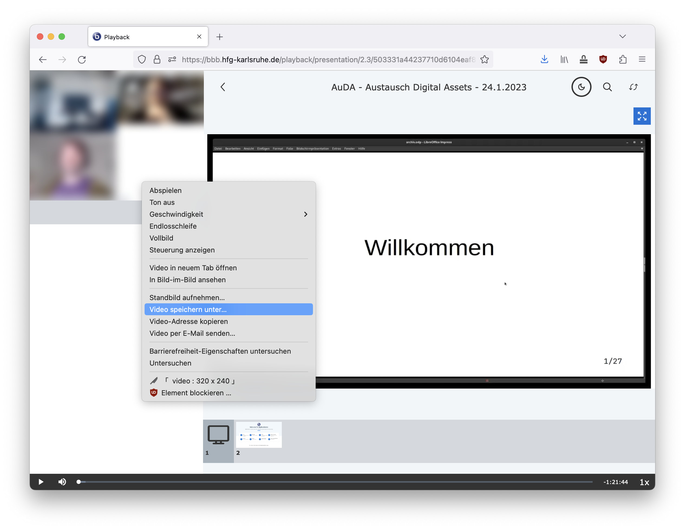

# BBB Mitschnitte aufbereiten

> Ziel dieses Mini-Tutorials ist es, die Videos eines BBB-Mitschnitts (recording) herunterzuladen, um daraus später ein Video zu schneiden.

Wenn eine Videokonferenz aufgezeichnet wird, speichert BBB zwei individuelle Videos auf dem Server:  
1. Webcams
2. Präsentation

Diese Videos müssen heruntergeladen werden und mit einem Video-Editig-Tool zusammengeführt (geschnitten) werden.

&nbsp;

## Videos vom BBB-Server herunterladen

Der BBB-Mitschnitt ist im Browser über die Startseite des jew. Raumes erreichbar, in dem die Video-Konferenz stattgefunden hat.

Der Mitschnitt besteht aus zwei Fenstern, die gleichzeitig abgespielt werden können (&rarr; Play-Button). Webcams und Präsentation sind dabei individuelle Video-Files.

<small>*In diesem Screenshot wurde das Webcam-Video unkenntlich gemacht.*</small>

Um ein Video zu erzeugen, müssen wir zunächst die beiden Videos individuell herunterladen. 

Führe die Maus über das Webcam-Video. Mit einem Rechtsklick im Browser (hier Firefox) erscheint ein Menü. Klicke `Video speichern unter...`

Wähle einen Ordner, in den Du die Video-Datei speichern willst.

Führe nun die Maus über das Präsentations-Video.  
Rechtsklick und `Video speichern unter...`

Nach erfolgreichen Download hast Du die beiden Videos auf Deiner Festplatte gespeichert. Im nächsten Schritt kannst Du sie in das Video-Editing-Tool Deiner Wahl importieren und arrangieren.