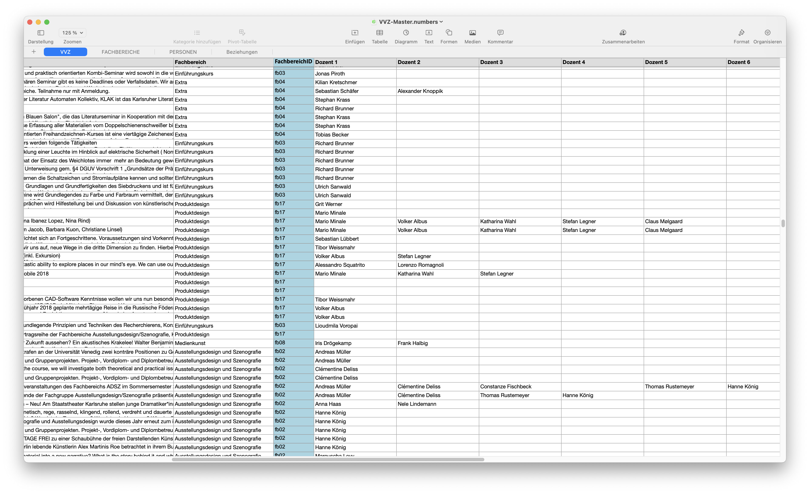
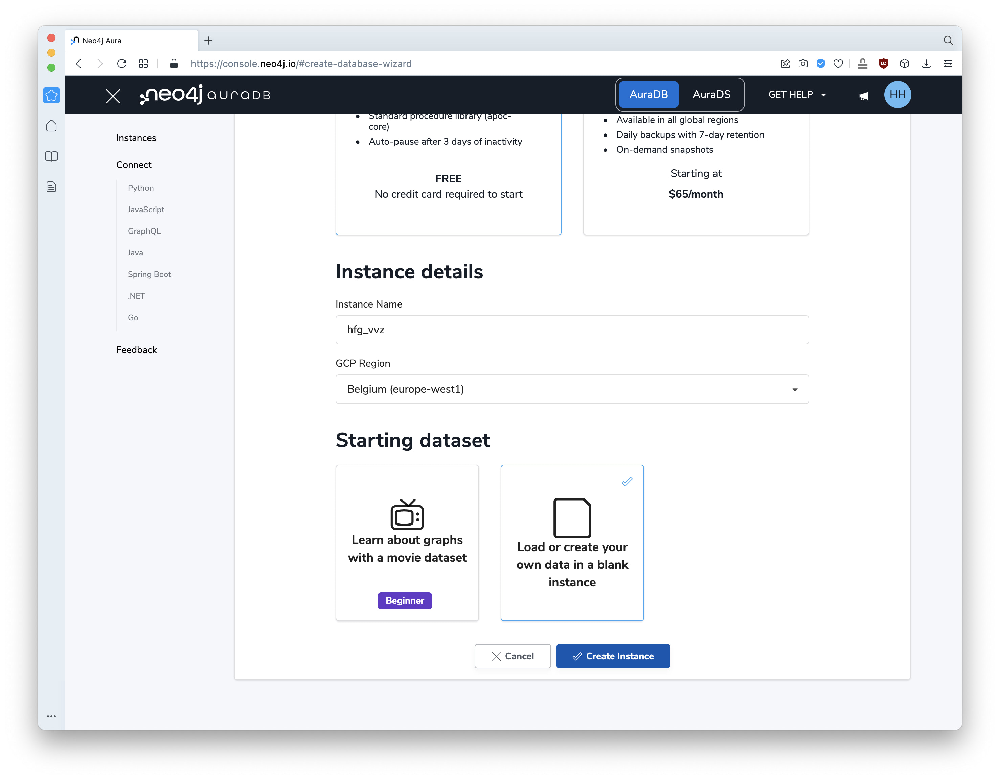
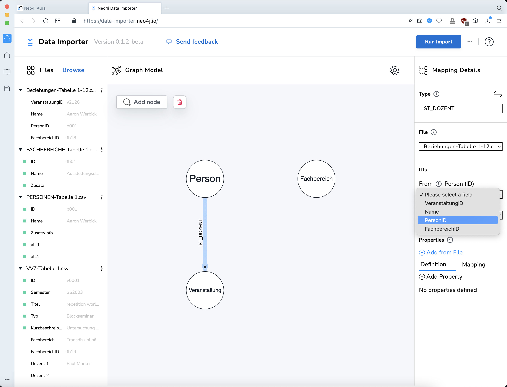
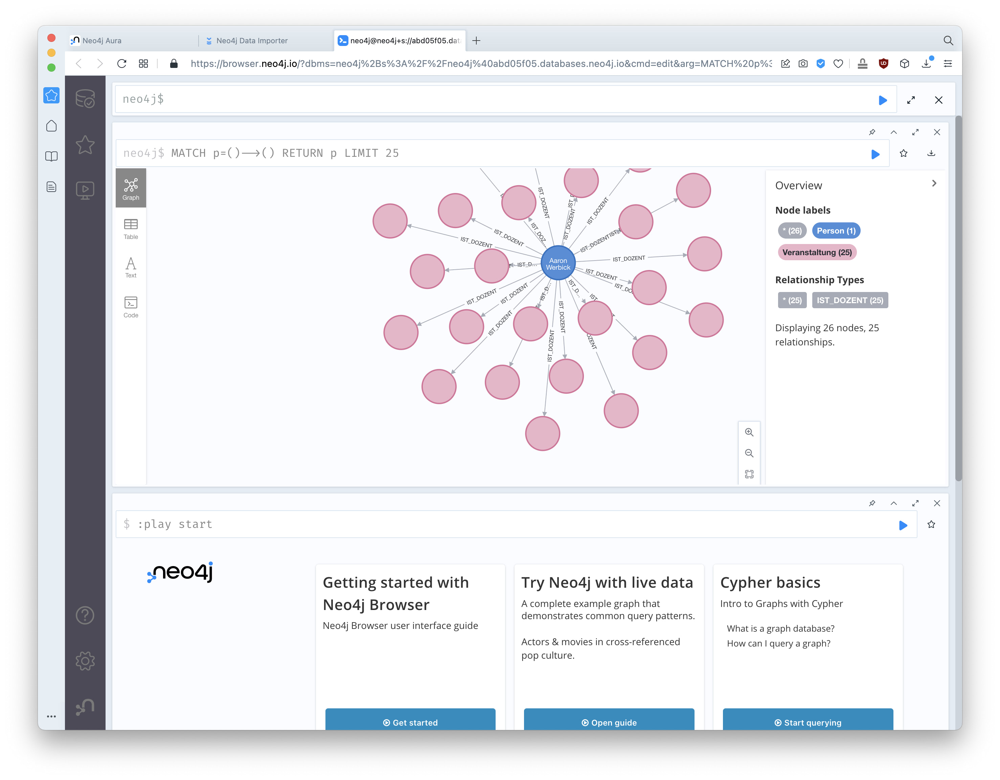

# Daten von Websites automatisiert auslesen und strukturiert in einer Tabelle speichern

> ZIEL: Einen strukturierten Datensatz aus den Vorlesungsverzeichnissen (VVZ) der HfG erzeugen, um die Daten in andere (Datenbank-)Systeme zu importieren. Die VVZ zwischen Sommersemester 2003 und 2022 sind online abrufbar unter https://www.hfg-karlsruhe.de/vorlesungsverzeichnis/ (Stand Mai 2022).

Für das Website Scraping / Web Harvesting kann man entweder ein Tool mit visueller Oberfläche verwenden (Point-and-Click) oder ein Script schreiben (Python).

Für unseren Usecase hat sich die App [Octoparse](https://www.octoparse.com/) als flexibelste und beste Lösung erwiesen (auf MacOS). Man definiert Bereiche und Loop-Abschnitte, die ausgelesen werden sollen. Klick-Automatisierungen und URL-Listen sind möglich.

Das anschließende Aufbereiten der Daten ist extrem wichtig – und zeitaufwendig. Nur strukturierte und bereinigte Daten können sinnvoll weiterverarbeitet werden.

&nbsp; 

&nbsp;

## Webpages parsen

Wir haben uns entschieden, die einzelnen Seiten je Semester herunterzuladen und lokal auszulesen. Dadurch sind die Ladezeiten kürzer. Außerdem können ungültige Zeichen das Auslesen durcheinander bringen. In unserem Fall hat Octoparse deswegen einige Titel von Veranstaltungen unvollständig ausgelesen. In Schritt 2 (s.u.) bereinigen wir den Code der heruntergeladenen Seiten. 

Hinzu kommt, dass die HfG-Website das Vorlesungsverzeichnis per AJAX lädt. Octoparse kann damit zwar grundsätzlich umgehen, aber die Seitennavigation hat den Ablauf trotzdem unnötig verkompliziert.

### Seiten herunterladen 

Wir haben also alle Semester aus dem [Online-VVZ](https://www.hfg-karlsruhe.de/vorlesungsverzeichnis/) als einzelne Seiten heruntergeladen ("Speichern unter..." im Browser).

### HTML Code säubern

Aufwendig aber leider nötig. Denn die Seiten enthalten ungültige Zeichen, weshalb Octoparse bestimmte Felder unvollständig ausliest.

Die heruntergeladenen Seiten müssen auf ungültige Zeichen durchsucht werden. Jeder gängige Code-Editor bzw. IDE eignet sich. Wir haben VSCodium und eine Kombination aus multireplace und händischer Korrektur verwendet. 

### Lokale HTML-Seiten im Browser zugänglich machen

Octoparse liest Seiten über HTTP aus. Wir haben die lokalen HTML-Seiten über die lokale Serverumgebung [Laravel Valet](https://laravel.com/docs/9.x/valet) verfügbar gemacht. Alternative Software: XAMPP MAMP.

### Octoparse: Liste der URLs anlegen und eintragen

Aus den heruntergeladenen Seiten haben wir eine Liste aller lokalen http-Adressen erzeugt.

### Octoparse: Abschnitte definieren, die ausgelesen werden sollen

Hier beginnt die eigentliche Arbeit beim harvesten. Es ist eine komplizierte Sache und kann recht langwierig sein, abhängig vom Website-Layout. In unserem war die Zuordnung der Fachbereiche zu den Veranstaltungen besonders kompliziert. Im Template wird jeder Fachbereich als gruppiert ausgegeben, wobei der Name des Fachbereichs nur einmal als Titel der Section erscheint. Dadurch ist ein einfacher Loop nicht möglich. Letztendlich liest das Skript nun den Fachbereich von der Detailseite aus, wo er glücklicher Weise auch ausgegeben wird – nur nicht im Sommersemester 2022. Die Fehlstellen mussten manuell nachgetragen werden.

### Octoparse: Script starten

Weil die Seminarbeschreibungen online abgerufen werden, dauert der Prozess sehr lange. Nur die lokalen Seiten auszulesen, geht deutlich schneller.

&nbsp;

## Daten exportieren

Octoparse bietet die Möglichkeit, Duplikate automatisch zu entfernen.  

Die Daten müssen lokal gespeichert werden. Die Software bietet verschiedene Formate an (CSV, XLSX, etc.). Für uns hat sich XLSX am besten geeignet.

&nbsp;

&nbsp;

# Daten aufbereiten

Das Aufbereiten der Daten ist extrem wichtig – und zeitaufwendig. Nur strukturierte und bereinigte Daten können sinnvoll weiterverarbeitet werden. 

## Personen/Namen

**Wichtig:** Die Zeilennummern (inkl. Leerzeilen!) bedeuten die Zuordnung der Person zu einer Veranstaltungen. Diese Information ist grundlegend und darf nicht verloren gehen. Deshalb immer mit Kopien der Hauptliste arbeiten, beispielsweise um zu sortieren oder Duplikate zu entfernen. 

Die ursprüngliche Liste enthält Namen so, wie sie geharvestet wurden. Viele Veranstaltungen haben mehrere Dozent*innen, die als durchgehender String vorliegen. Beispiel: 
> SS2007 | Campfire Talks/ Raus aus der HfG II | "Prof. Michael Bielicky Ludger Pfanz"

### Strukturierte Daten erzeugen 

Um strukturierte Daten zu erzeugen, brauchen wir 
1. eindeutige Bezeichnungen: "Prof. Michael Bielicky" ist dieselbe Person wie "Michael Bielicky"; manche Personen führen ab einem gewissen Zeitpunkt Doppelnamen; es finden sich unterschiedliche Schreibweisen; etc.
2. jede Person in einer eigenen Zelle

Wir suchen nach Mustern, um möglichst viel durch `suchen & ersetzen` zu lösen.

**OpenOffice**  
1. Neue Mappe anlegen, ursprüngliche Liste duplizieren.  
2. Akademische Titel &rarr; `löschen`  
Suchen nach `"`, `Prof. `, `Dr. `, etc. und ersetzen mit nichts (löschen).  *Damit verlieren wir manche Informationen (wie akademischer Grad). Diese könnten auch in eine neue Spalte kopiert werden. Oder – besser noch – man arbeitet mit einer Referenzdatenbank für Namen und verknüpft mittels Identifier (ID).*
3. Zeilenumbrüche &rarr; `;`  
Um Strings zu trennen erzeugen wir ein eindeutiges Zeichen zwischen Namen. Glücklicher Weise sind in unserer Liste mehrere Dozenten durch einen Zeilenumbruch getrennt. Den Zeilenumbruch können wir durch einen Strichpunkt ersetzen. Dazu verwenden wir *regular expressions* und suchen nach dem Zeichen `\n`.
4. Kommata &rarr; `;` 
5. Nach Klammern suchen `(` und ggf. bei Namen in Klammern wieder `;` &rarr; `,` damit diese Namen nicht getrennt werden.

**Wichtig:** Diese Liste (Personen durch Semikolon getrennt) wird später noch gebraucht &rarr; zwischenspeichern!

In einem neuen Arbeitsblatt wählen wir `Text import` und definieren das Semikolon als Trennzeichen. Dadurch wird pro Zeile jeder Name in eine eigene Spalte geschrieben. 

Diese Spalten können wir dann in die Master-Liste einfügen.  
**Wichtig:** Die Zuordnung der Dozenten zu den Veranstaltungen geschieht über die Zeilennummern. Die neue Liste muss also an die richtige Stelle eingefügt werden: 
1. alle Zeilen und Spalten markieren
2. in der Master-Liste in die erste leere Spalte rechts, oberste Zeile einfügen

&nbsp; 

### Distinke Personen-Liste erzeugen (keine Duplikate)

Wir brauchen eine Liste aller Personen ohne Duplikate. Jede Person bekommt eine eindeutige ID. Später stellen wir so Referenzen zwischen Personen und Veranstaltungen her. Außerdem bietet es sich auch für andere Zwecke an, eine zentrale Personen-Liste mit eindeutigen Identifiern zu führen.

Die Liste, in der die Personen durch Semikolon getrennt sind, dient als Grundlage; alles kopieren und im Editor einfügen.

**SublimeText (Text Editor)**  
`;` &rarr; `\n` (Zeilenumbrüche), um eine eindimensionale Liste zu erzeugen

**OpenOffice**  
Diese Liste sortieren.

**SublimeText**  
Ggf. sortierte Liste bereinigen: Leerzeichen am Wortanfang löschen.

**OpenOffice**  
1. Liste sortieren
2. Distinkte Liste erzeugen (Duplikate löschen)
   
3. Liste ohne Duplikate manuell prüfen:
   - Verschiedene Schreibweisen desselben Namens zusammenführen; eine Haupt-Schreibweise festlegen; Varianten in Spalten neben der Hauptschreibweise dokumentieren.  
   &rarr; Varianten in ursprünglicher Liste suchen und durch Hauptschreibweise ersetzen `suchen & ersetzen`  
   - Sinnlose Einträge wie "N.N.", etc. löschen.  
   &rarr; Sinnlose Einträge in ursprünglicher Liste `suchen & löschen`  
   - Sonstige Ungereimtheiten klären.  
   &rarr; Ungereimtheiten in ursprünglicher Liste `suchen & ersetzen`  
4. Die so entstandene distinkte und eigenständige Personen-Liste mit IDs versehen.

&nbsp;

### Fachbereiche

#### Distinkte Liste erzeugen (Duplikate löschen)

#### Liste bereinigen
- z.B. Art "Research and Media Philosophy" ist identisch mit  "Kunstwissenschaft und Medienphilosophie"
- den String "Philosophie und Aesthetik (bis SS 2016)" trennen in "Philosophie und Aesthetik" und "bis SS 2016"

Einträge der bereinigten Liste in der "Fachbereich"-Spalte der Master-Liste `suchen & ersetzen`. **Achtung:** NUR in der Spalte "Fachbereiche", nicht in der Seminarbeschreibung etc.

Fehlende Fachbereiche recherchieren und nachtragen.

&nbsp;

### Listen zusammenführen, Beziehungen herstellen

Jeder Knoten, den wir referenzieren wollen, braucht eine **eindeutige ID**.
- Vorlesungen/Veranstaltungen: v0001  
- Personen: p001  
- Fachbereiche: fb01  

#### Beziehungen

Excel-Funktion `XVERWEIS` verwenden.  

Formel für die Fachbereiche:  
`XVERWEIS(F2;FACHBEREICHE::Tabelle 1::Name;FACHBEREICHE::Tabelle 1::ID;)`  

#### Beziehungen Person-Veranstaltung-Fachbereich

Gegeben ist eine zweidimensionale Beziehung von `Dozenten` und `Veranstaltungen`. Denn jede Veranstaltung kann mehrere Dozenten haben. Ziel ist eine eindimensionale Liste aller Personen, die mit einer Veranstaltung verbunden sind (`IST_DOZENT`).  

Diese Liste wird manuell generiert – ein aufwendiger und fehleranfälliger Schritt!

Jede Spalte `Dozenten` mit der Spalte `VeranstaltungID` kopieren. 

Die einzelnen Tabellen zu einer langen, eindimensionalen Tabelle verbinden (jeweils kopieren und am unteren Ende einfügen). Das Resultat ist eine eindimensionale Liste aller Dozenten je Veranstaltung mit der korrespondierenden `VeranstaltungsID`.  

Diese Liste ist die Grundlage der Tabelle `Beziehungen`.  

`PersonID` und `FachbereichID` werden dynamisch erzeugt. Es sind Referenzen auf die Tabellen `VVZ` und `Personen`.

Formel für die `PersonID`:  
`XVERWEIS(B2;PERSONEN::Tabelle 1::Name;PERSONEN::Tabelle 1::ID)`

Formel für die `FachbereichID`:  
`XVERWEIS(A2;VVZ::Tabelle 1::ID;VVZ::Tabelle 1::FachbereichID;)`

&nbsp;

&nbsp;

# Daten importieren: Neo4j

Für Datenanalyse arbeiten wir mit einer Graphdatenbank, die einfach und anschaulich (komplexen) Beziehungen zwischen Daten darstellen kann. 

Wir verwenden [Neo4j AuraDB](https://neo4j.com/cloud/platform/aura-graph-database/), einen cloud service mit free plan Option, und importieren unsere Liste. 

Einen Account anlegen und [einloggen](https://console.neo4j.io/).  
Neue Datenbank-Instanz:  
- Instance type: AuraDB (free)
- Instance Name: hfg_vvz (in unserem Fall)
- GCP Region: Belgium (europe-west1)
- Starting dataset: Load or create your own data in a blank instance

Im nächsten Schritt wird das Passwort für die Datenbank angezeigt. Es muss abgespeichert werden, weil es später beim Import und jeder anderen Abfrage bzw. Manipulation gebraucht wird.

Neo4j bietet einen Importer an.  
[Youtube-Tutorial](https://youtu.be/vI2XZOf4hVY)

Zunächst definieren wir das Modell. Eine Graphdatenbank besteht aus Nodes und Relations, Knoten und Verbindungen/Kanten. Wir definieren den schematischen Aufbau unserer Datenbank. Sie besteht aus drei `node`-Typen – Veranstaltung, Person, Fachbereich – und den Beziehungen untereinander.

#### Nodes

Mit `Add node` erzeugen wir drei Nodes.

Spätestens jetzt brauchen wir Daten. Als Datenbasis exportieren wir die Master-Liste als `CSV`. Es bietet sich an, für jede Mappe eine eigene Datei zu exportieren. In unserem Fall:

`Beziehungen.csv`  
`Fachbereiche.csv`  
`Personen.csv`  
`VVZ.csv`

Diese Dateien importieren wir per `drag & drop` in die linke Spalte des Neo4j-Importers. Nun sind unsere Daten hier verfügbar. Wir verknüpfen die Nodes mit den jeweiligen Dateien...  

...und wählen die Properties, die wir importieren wollen.  

Wichtig ist, zu definieren, welche Proprty als ID verwendet werden soll, um eindeutige Zuordnungen zu gewährleisten. Zu diesem Zweck hatten wir weiter oben an jede Person eine eindeutige ID vergeben.  

Bei der Node `Veranstaltung` importieren wir nicht alle Properties. Die Tabelle enthält mehr Informationen, als wir an dieser Stelle brauchen:
- `Fachbereich` soll als Relation zur Node "Fachbereich" erzeugt werden (nicht als Property)
- `FachbereichID` wird für eben diese Relation verwendet
- `Dozent 1` etc. soll ebenfalls als Relation entstehen. Die Zuordnung befindet sich in `Beziehungen.csv`

#### Relations

Relationen können einfach mit der Maus gezogen werden. Wir definieren zunächst die Relation `IST_DOZENT` zwischen `Personen` &rarr; `Veranstaltungen`. Den Namen dieser Relation vergeben wir möglichst sprechend und einfach. 

Die Zuordnung befindet sich in der Datei `Beziehungen.csv`, die wir bei "File" auswählen. Die eigentliche Zuordnung muss aber noch definiert werden. Dazu wählen wir welche IDs miteinander in Relation gesetzt werden sollen: `From` / `To`. 

Damit ist die erste Relation definiert. Der Relation selbst könnten noch Properties mitgegeben werden, was aber in diesem Fall nicht nötig ist.

Dasselbe wiederholen wir für die `TEIL_VON`-Relationen  
`Person` &rarr; `Fachbereich`  
`Veranstaltung` &rarr; `Fachbereich`

Klick auch **Run Import**. Der Importer fragt nach dem Passwort der Datenbank (siehe oben).

Import erfolgreich.

Neo4j bietet zwei Werkzeuge für die Abfrage der Graphdatenbank an, den "Neo4j Browser" und "Bloom". Der "Browser" kann direkt hier gestartet werden.

Eine erste Abfrage:

