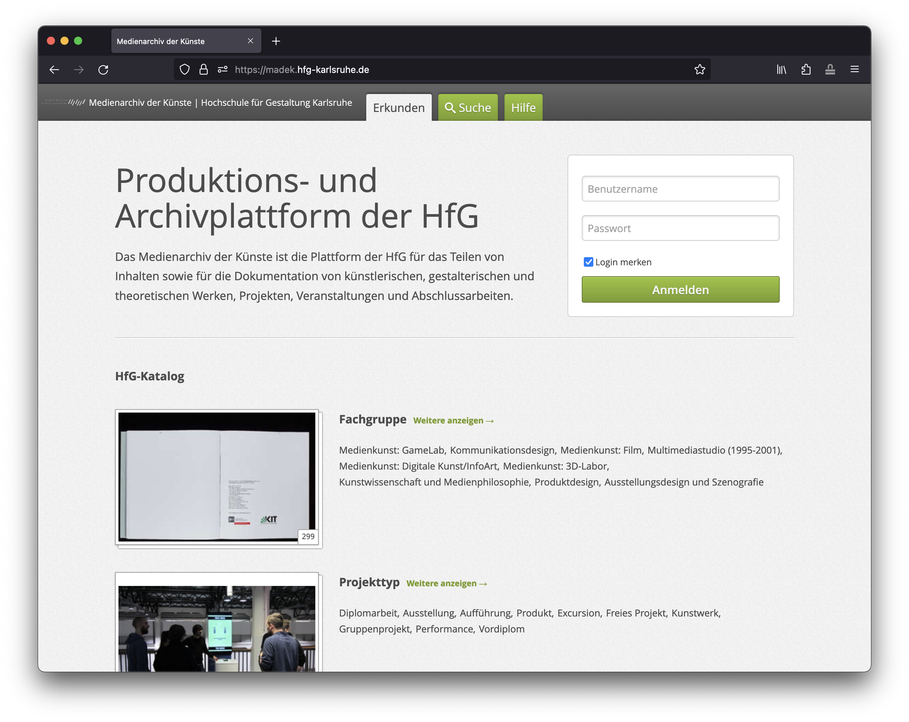
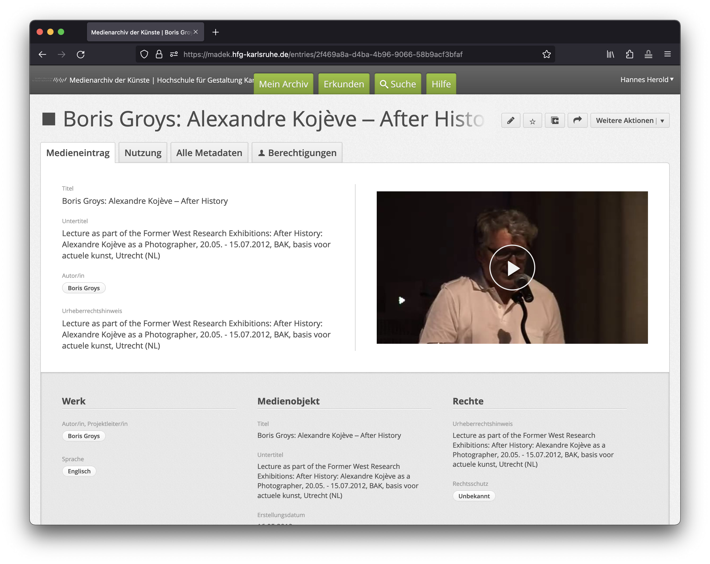
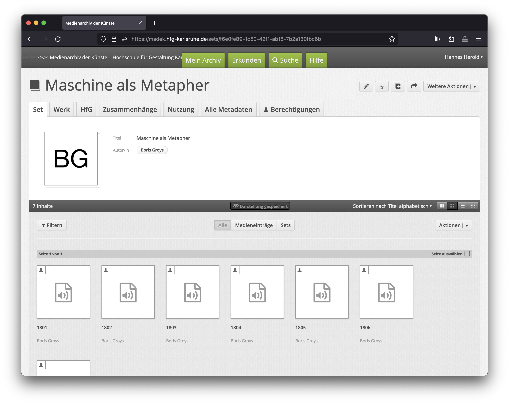
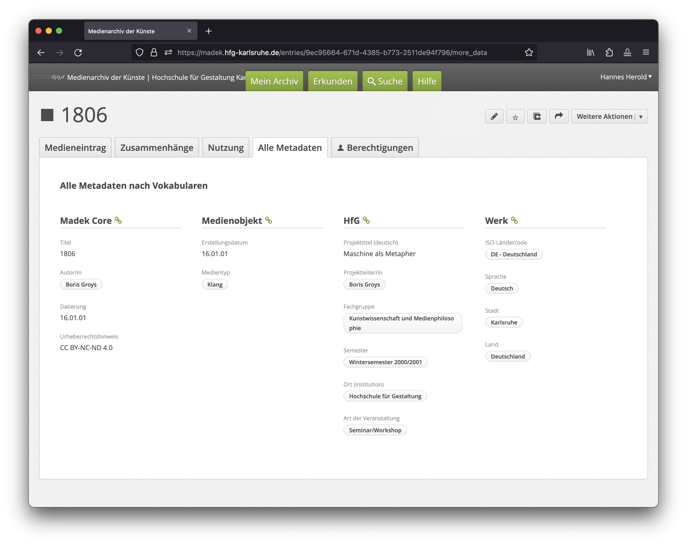
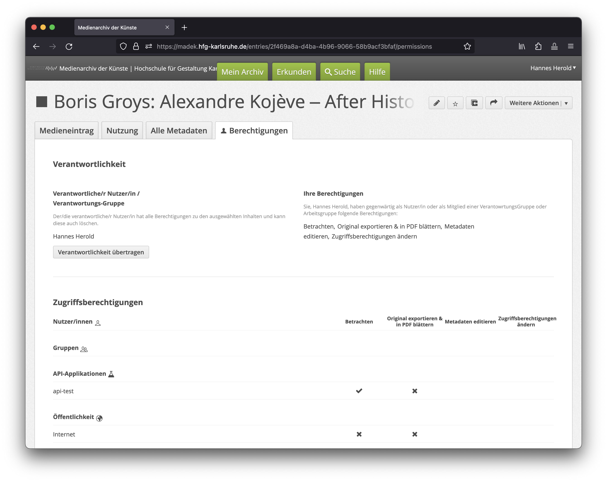
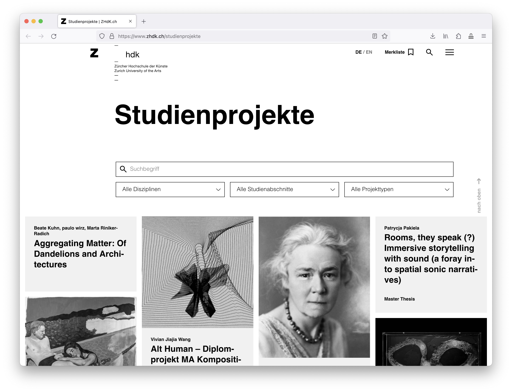
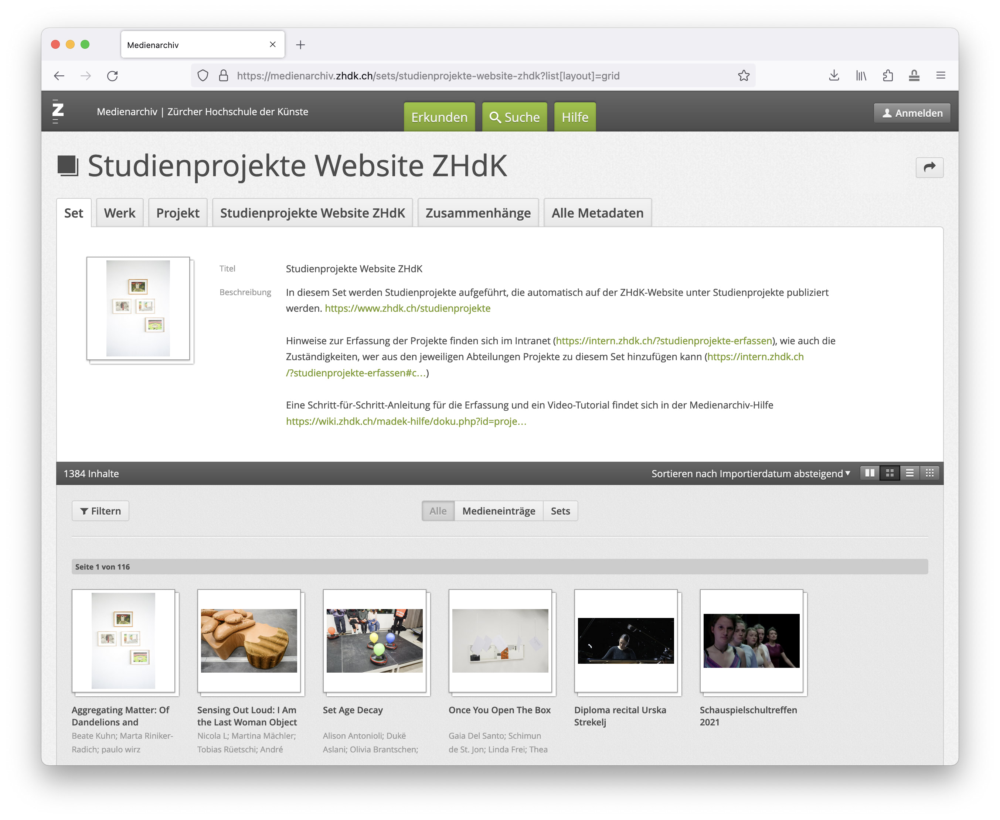

## About Madek

Madek is a media archival, management and sharing system that can archive video, audio and image files along with their metadata.

Madek-instance of ZHdK  
http://medienarchiv.zhdk.ch

Information and links to documentation etc.:  
https://www.zhdk.ch/miz/archive-1387/madek/madek-software

### Links

User-oriented overview:  
https://doku.madek.ch/

Support, tutorials  
https://wiki.zhdk.ch/medienarchiv/doku.php

Technical documentation:  
https://madek.readthedocs.io/en/latest/

&nbsp;

## How it works

### Media entries

Madek organises work with media: images, sounds, videos and other documents. These are imported into the system as media files.  

The fundamental entity in Madek is a media entry. A media entry consists of the stored file and all related information, metadata and access permissions.

  

### Sets

As soon as a large number of media entries are available, it becomes necessary to structure them for one's own work but also to make them accessible to others. This is done, on the one hand, by entering data for each media entry, but also by placing media entries in sets.  

A set is basically similar to a folder on one's own computer or a physical filing system - with the difference that media entries can be in several sets. In addition, sets can be nested as deeply as desired. For example, a study area can create sets for all projects created there and collect these sets in an overall set.

### Metadata

Metadata can be assigned to both media entries and sets, and the choice of fields may differ depending on the configuration of an instance.

Some basic metadata is mandatory in order to upload media. 

### Access permissions

Madek allows differentiated control of access permissions for each media entry and set. Permissions can be assigned to individuals, work groups, the public or API applications, i.e. other systems such as websites that obtain content from Madek. 

Each media entry and each set has a responsible person who has all permissions and, as a default setting, is also the only person who can see and edit their own entries.

Here you can see the access permissions on media-entry-level:  

### Further reading

For deeper insights into how Madek works and the feature it provides, see the documentation:  
https://doku.madek.ch/

&nbsp; 

## API

Madek features a REST API that returns JSON / JSON-ROA.

API documentation:  
https://medienarchiv.zhdk.ch/api/docs/

API browser:  
https://medienarchiv.zhdk.ch/api/browser/

GraphQL API – experimental, work in progress:  
https://github.com/Madek/madek-graphql-api

&nbsp;

### Example Usage: ZHdK Studienprojekte
This area of the ZHdK-website features content from Madek, pulled via API:  
https://www.zhdk.ch/studienprojekte

The content is organised in the media archive of ZHdK in a `set` called "Studienprojekte Website ZHdK":  
https://medienarchiv.zhdk.ch/sets/studienprojekte-website-zhdk  

The projects in this `set` are automatically published on the ZHdK website. However, ZHdK has established an editor-based workflow. Only responsible web editors have access to this `set` and are responsible for publications. 

So there are two sides to the publication workflow. Complementary to the tasks of web editors (as just described), students must follow certain steps:

1. Students who want to publish a project must create an additional `set` that serves solely to provide the content for the website. 
2. The media entries to be published need to be added to this set. 
3. Some specific metadata need to be provided.
4. Access permissions of sets and media entries need to be provided. In the case of the ZHdK, these are: 
   - the editors of the ZHdK website 
   - the Support Media Archive
   - the API websitezhdk
   - the public
5. As ZHdK uses an editor-based workflow (as described above), students need to contact the web editor in charge and ask for publication.

Read more about this workflow here:  
https://wiki.zhdk.ch/medienarchiv/doku.php?id=projektschaufenster

&nbsp;

## Active development

Madek is open source software, developed on GitHub:  
https://github.com/Madek/Madek 

**Release info**  
https://medienarchiv.zhdk.ch/release

**Future development**  
ZHdK's focus in developing Madek is on archive and long-term storage, see this current GitHub-project:  

https://github.com/Madek/Madek/projects/11

> **Langzeitarchiv**  
> Erweiterung von Madek um wichtige Funktionen für Langzeitarchiv
> - Userverwaltung
> - Zugangsregelungen
> - Datensicherheit

&nbsp; 

## Server set-up
Setting up a Madek server is quite complex. Here's the guide:  
https://github.com/Madek/madek-instance