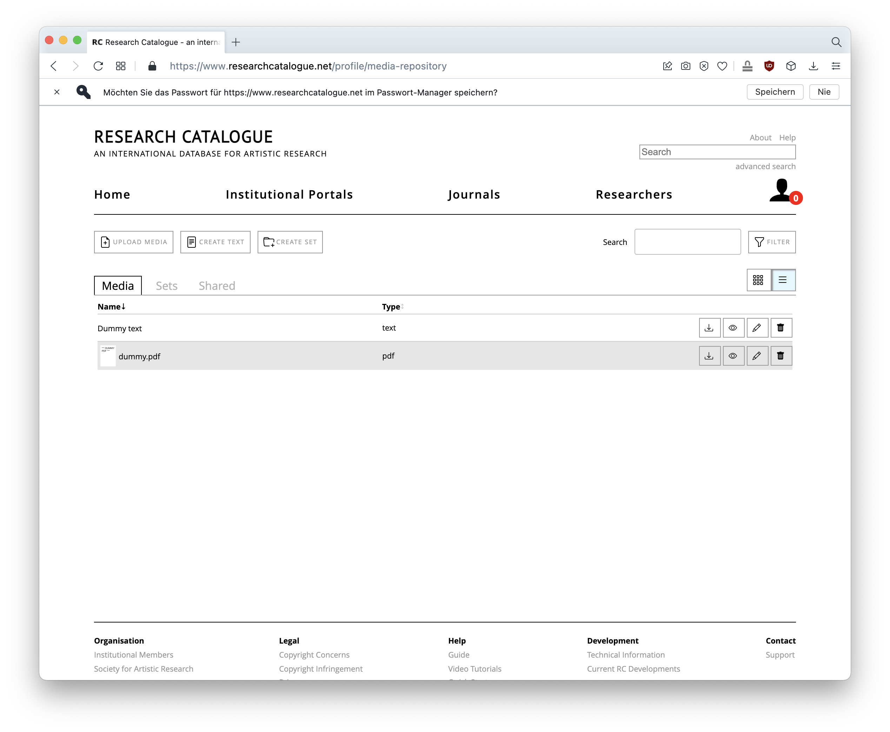
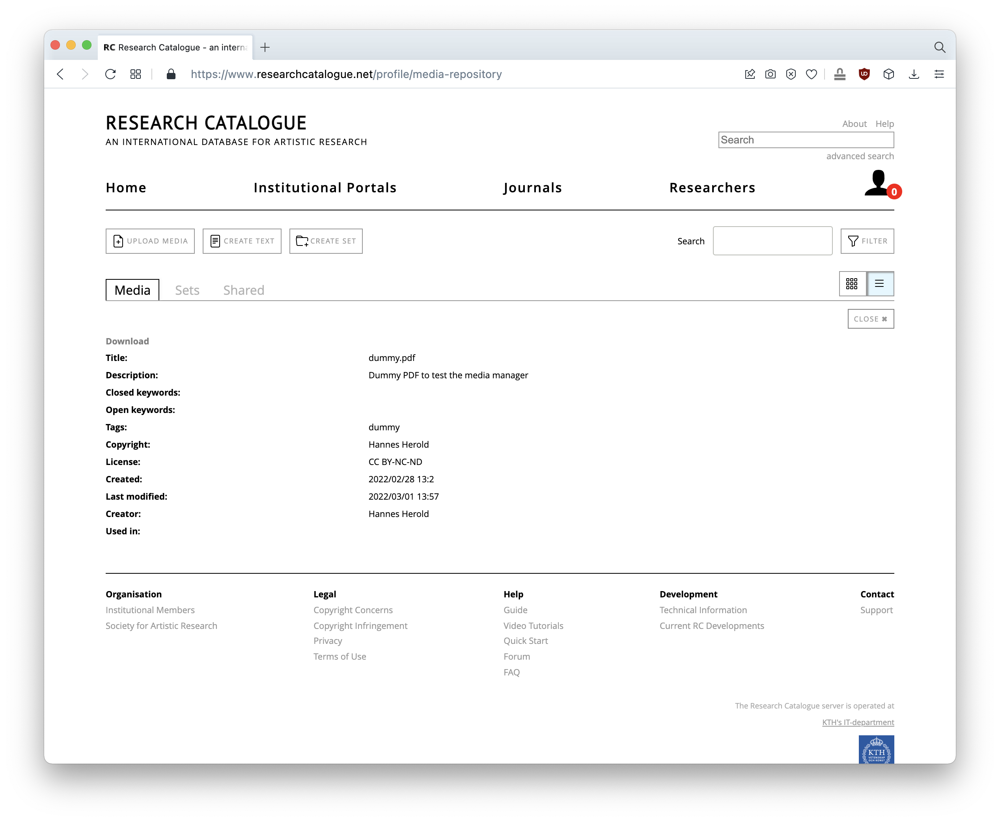
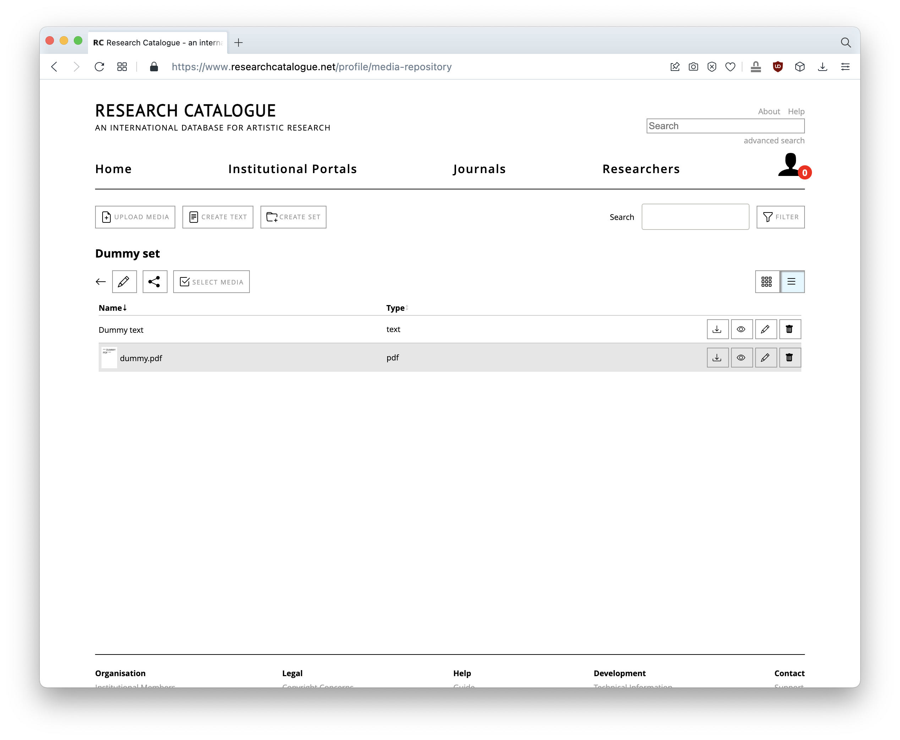
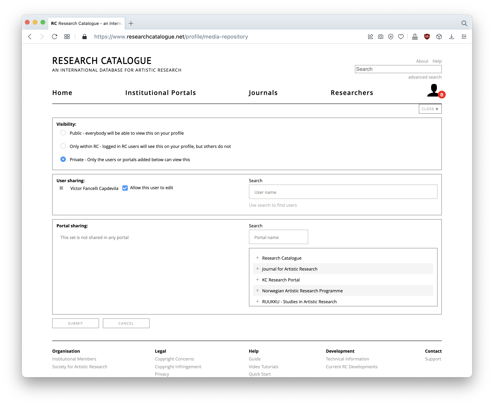
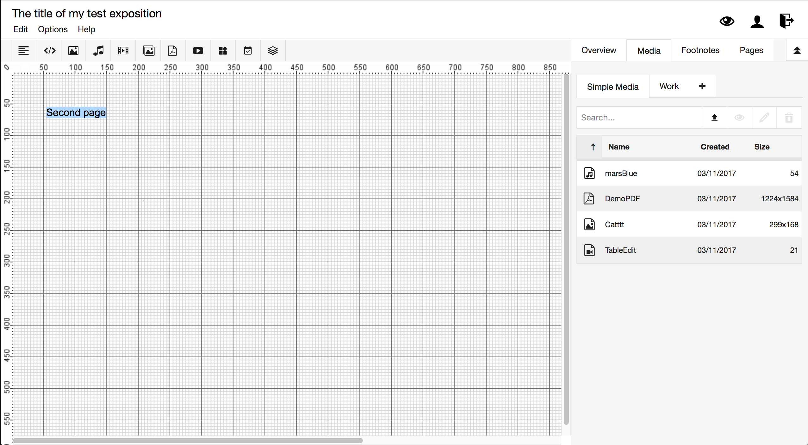
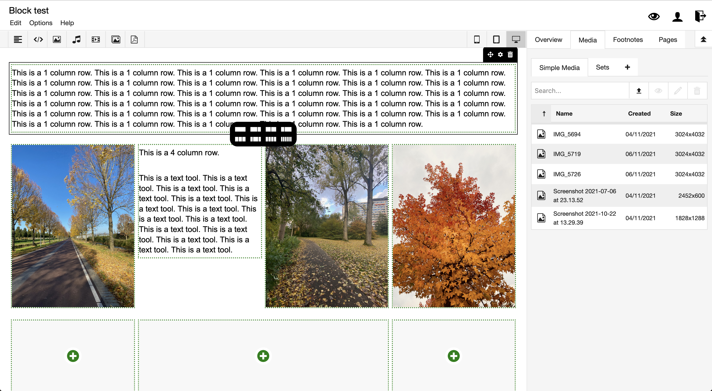

- International database for artistic research  
- Open space for experimentation and exchange  
- Network of academic institutions (focus on art)

Website  
https://www.researchcatalogue.net/  

Webinar/walkthrough  
https://www.researchcatalogue.net/view/1380657/1554589  

Video tutorials  
https://www.researchcatalogue.net/view/273532/273533/  

Guide  
https://guide.researchcatalogue.net/  

Development  
https://societyforartisticresearch.github.io/rcblogpublic/    
https://societyforartisticresearch.github.io/rclogbook/  

GitHub  
https://github.com/orgs/SocietyForArtisticResearch/repositories  
https://github.com/SocietyForArtisticResearch/parse-exposition  

&nbsp; 

## Key Features

- Visual way of creating expositions using different media and text
   - Projects can be designed (unlike Madek)
   - Even stronger focus on publication (compared to Madek)
- Media repository
- Collaboration and publishing platform
- Non-commercial, free to use
- backbone for 
   - teaching purposes
   - student assessment
   - peer review workflows
- Network of academic institutions, art universities, amongst others: 
   - University of Applied Arts Vienna, University of the Arts Rotterdam, Danish National School of Performing Arts, Stockholm University of the Arts, Zurich University of the Arts ... 
   - complete list: https://societyforartisticresearch.org/about/institutional-members/

&nbsp;

## Media Repository

The file handling resembles Madek. Users can upload different media or create text files.  
- Media repository on a per user basis
- Each file is treated separately
- No upload limit  

On every upload, basic metadata needs to be specified.  
- Each file is equipped with meta data. 
- Some meta data is mandatory (like Copyright)  

Files can be organised in `Sets`.  

`Sets` can be shared with other users or other portals.   

&nbsp;

## Expositions

In Madek, users can only structure their content/media, but how it's presented depends on the website/client accessing the data. For example, a "Schaufenster" on the HfG website would use its template to list projects. The website of the department uses another one. So the same project might look different in different contexts.  

Research Catalogue emphasises the publication of projects. Therefore it offers a tool to compile media and texts visually. 

### Canvas
This workspace uses an open canvas where users can freely position objects. 

Here is an example that makes use of the canvas-tool:  
https://www.researchcatalogue.net/view/951575/951576/1545/1211

### Block-editor
Alternatively, there's the block-editor which is more restrictive – but also responsive. 

Here another example using the block-editor:  
https://www.researchcatalogue.net/view/949733/949734

&nbsp;

## What’s nice about Reserach Catalogue

- Active network
   - Friendly and interested people
   - Active development of software
   - They care about good documentation
   - Different academic institutions involved (focus on art academies)
   - Social network of researchers/artists
- Interface
   - Fast (short loading time)
   - Rather modern
   - Partly accessible on smartphones
- Long-term project
   - Seems to be based on a solid infrastructure
   - Hosted by Royal Institute of Technology, Stockholm

&nbsp;

## Potential use

- Presentation of work, publication
   - Flexible canvas for creating presentations, combination of different media
   - UNCLEAR but maybe possible to publish in different contexts (via APIs)
- Media-platform: transferring/sharing files
   - The media repository might be used by groups, for example press, Jahresbericht, etc.
- Handing in diploma projects
   - Making use of integrated review workflow
- Becoming part of larger network

&nbsp;

## Potential pitfalls

- Restrictive legal framework for publication
   - *“The use and distribution of any material uploaded to the Research Catalogue is allowed only - within SAR web domains (such as the Research Catalogue itself) and not beyond this.”* (https://www.researchcatalogue.net/portal/faq 1.9)
   - So, it seems to be unwanted or even forbidden to distribute material (via APIs) over other - websites.
- No APIs available at the moment
- Not open source
   - Although some modules can be found on GitHub, the software itself seems not to be open source
   - We cannot assess the technical infrastructure
- Pretty academic, maybe too "scientific" for us

&nbsp;

## Questions

- LDAP-Integration
   - we’d need to synchronize with our HfG user account management
- API
   - we’d need an API to feed other websites and services with data from RC 
   - we’d need to distribute material through other channels/websites
   - we’d need to connect to whatever archive-system we’ll use
- Group accounts
   - we’d need to create those for the labs, press, etc.
- Madek
   - what’s the secret connection with Madek?
