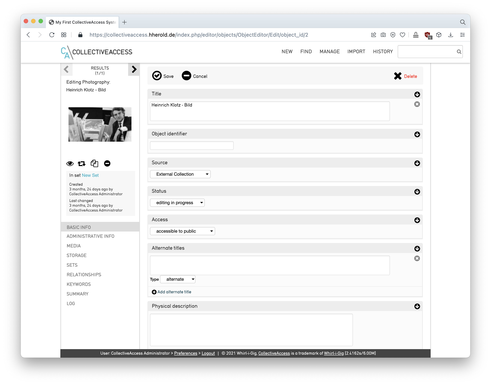

# Various database systems in the scope of media platform / archive / DAM

&nbsp;

## Swiss Archive of the Performing Arts SAPA Foundation
`Birk Weiberg`  

The SAPA Foundation collects, documents, archives, preserves and disseminates works from the field of the performing arts (dance, theatre, performance art, etc.) produced in Switzerland, associated with Switzerland or important to it. All these documents form the Helvetica of the performing arts. In the performing-arts.ch database, information about SAPA's archival holdings and about the performing arts in Switzerland will be successively made available as Linked Data. Both the data and the interfaces are continually being expanded to provide new ways of searching and interacting with the archive collections.

Website  
https://www.performing-arts.ch/resource/sapa:About

SPA Specifications  
https://sapa.github.io/spa-specifications/

GitHub  
https://github.com/sapa

Made with Metaphactory  
https://metaphacts.com/

&nbsp;

## Research Catalogue

- International database for artistic research
- Open space for experimentation and exchange
- Network of academic institutions (focus on art)

Website  
https://www.researchcatalogue.net/

Webinar/walkthrough  
https://www.researchcatalogue.net/view/1380657/1554589

Video tutorials  
https://www.researchcatalogue.net/view/273532/273533/

Guide  
https://guide.researchcatalogue.net/

See also  
https://github.com/orc-hfg/ressources/wiki/Research-Catalogue

&nbsp;

## Omeka-S

Omeka S is a next-generation web publishing platform for institutions  interested in connecting 
digital cultural heritage collections with  other resources online.

Website  
https://omeka.org/s/

User Manual  
https://omeka.org/s/docs/user-manual/

Developer Documentation  
https://omeka.org/s/docs/developer/

GitHub  
https://github.com/omeka/omeka-s

&nbsp;

## CollectiveAccess

CollectiveAccess is free, open-source software for cataloguing and 
publishing museum and archival collections.

Website  
https://collectiveaccess.org/

Manual  
https://manual.collectiveaccess.org/

GitHub  
https://github.com/collectiveaccess

&nbsp;

## ConedaKOR

ConedaKOR, ein webbasiertes Datenbanksystem mit einer graphbasierten Architektur, ConedaKOR dient der Verwaltung und Präsentation akademischer Objektsammlungen aus den bildbasierten Kultur- und Geisteswissenschaften.

ConedaKOR is a web based application which allows you to store arbitrary documents and interconnect them with relationships. You can build huge semantic networks for an unlimited amount of domains. This integrates a sophisticated ontology management tool with an easy to use media database.  

Website  
https://coneda.net/

GitHub  
https://github.com/coneda/kor

&nbsp;

## Are.na

Are.na is a platform for connecting ideas and building knowledge.  

Website  
https://www.are.na/

&nbsp;

---

&nbsp;

&nbsp;

## Less interesting for us

### GAMS
Geisteswissenschaftliches Asset Management System  
https://gams.uni-graz.at/

GAMS ist ein OAIS-konformes Asset Management System zur Verwaltung, Publikation und Langzeitarchivierung digitaler Ressourcen aus allen geisteswissenschaftlichen Fächern. Es bietet MitarbeiterInnen aus Forschung und Lehre, aber auch Studierenden in Projekten die Möglichkeit, diese Ressourcen zitabel und mit Metadaten versehen zu verwalten und zu veröffentlichen.

&nbsp;

### RADAR 
https://radar.products.fiz-karlsruhe.de/

KIT Karlsruhe: Mit RADAR können Wissenschaftler:innen Forschungsdaten 
aus abgeschlossenen wissenschaftlichen Studien und Projekten über ein 
Webportal hochladen, zu Datenpaketen zusammenstellen, diese mit Metadaten 
beschreiben, begutachten lassen, dauerhaft archivieren oder öffentlich zugänglich machen.

Konzentriert sich eher auf naturwissenschaftliche Forschung. Nicht so sehr medienbasiert wie Madek. Siehe zum Beispiel „Datenpakete“:  
https://radar.products.fiz-karlsruhe.de/de/radarsupport/videotutorials#datenpakete+erstellen

&nbsp;

### Medien-Repositorium HU Berlin
https://medien.hu-berlin.de/

Medien-Repositorium zum speichern, verwalten, ordnen und freigeben von Medien-Dateien. Web-offene Präsentationen sind ebenso möglich wie kollaboratives Arbeiten in geschlossenen Arbeitsgruppen. Das Medien-Repositorium hilft sowohl kleineren Teams als auch größeren Forschungsprojekten bei der Verwaltung von Medienbeständen und deren nachhaltiger Sicherung.

&nbsp;

### DSpace
https://duraspace.org/dspace/

DSpace is an open source repository software package typically used for creating open access repositories for scholarly and/or published digital content. 

Probably too complex for our usecase.

https://en.wikipedia.org/wiki/DSpace  
https://wiki.lyrasis.org/display/DSDOC7x/Installing+DSpace  

&nbsp;

### Fedora
https://duraspace.org/fedora/

Fedora is the flexible, modular, open source repository platform with native linked data support.  
https://en.wikipedia.org/wiki/Fedora_Commons

&nbsp;

### Islandora
https://islandora.ca/

Open source digital asset management based on Fedora Commons, Drupalbased on Fedora Commons, Drupal  
https://en.wikipedia.org/wiki/Islandora

&nbsp;

### Invenio
https://inveniosoftware.org/products/framework/

Open Source framework for large-scale digital repositories. Science context.  
Probably too complex for our usecase.

&nbsp;

### Samvera
https://samvera.org/

Open-source digital repository software product. Samvera main components are Fedora Commons, Solr, Blacklight, and HydraHead (a Ruby on Rails plugin and gem, respectively).

&nbsp;

---

&nbsp;

&nbsp;

## Misc

### A list of repository software
https://www.forschungsdaten.org/index.php/Repository_Software

### List of collections management systems
https://collectionstrust.org.uk/software/

This list is more for inspiration. For us, the solutions listed are probably not suitable. They are not so much work platforms or asset management systems for multiple users like Madek, but management software for museum collections.

### EASYDB
https://www.programmfabrik.de/easydb/easydb-university-diathek/

Digitale Bilddatenbank Software für den Bereich Forschung und Lehre.  
Proprietäre Software.
