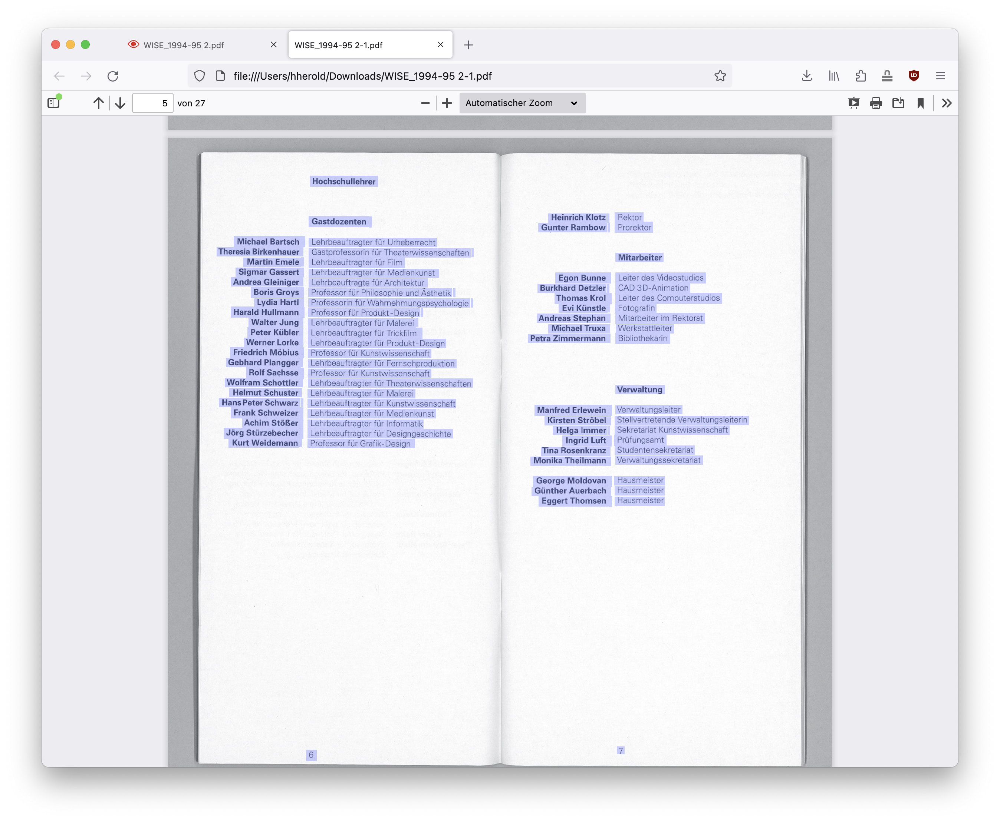
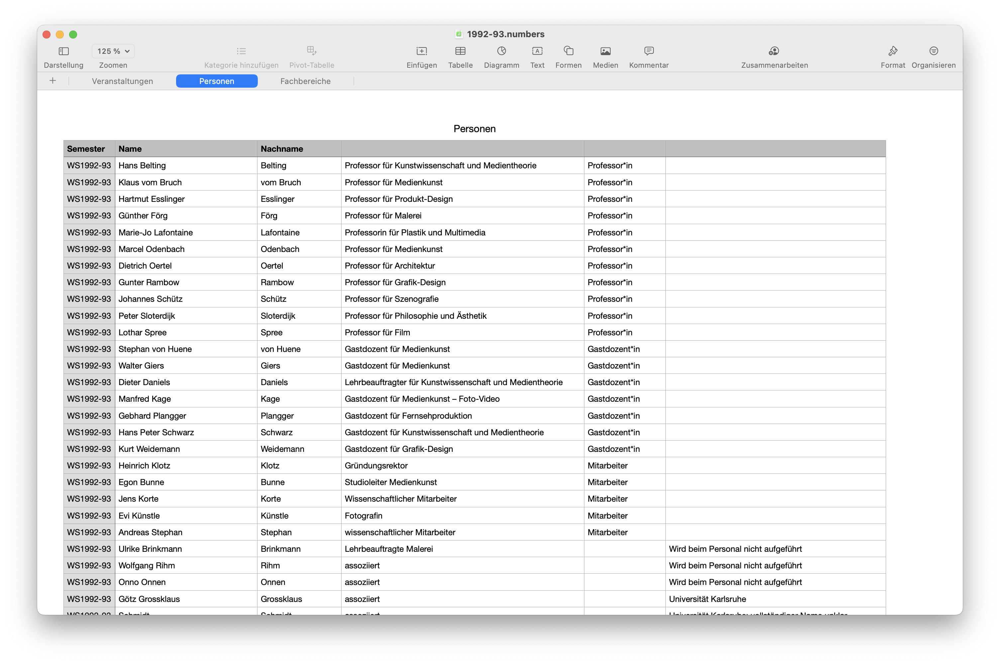

# Texte aus gescannten Bildern extrahieren und strukturieren

Für die Texterkennung in PDFs haben wir verschiedene Tools verglichen. Bei unseren relativ schlechten Vorlagen hat der Dienst [PDF24 Tools](https://tools.pdf24.org/de/pdf-text-erkennen) gut funktioniert.

&nbsp;

### OCR-Text kopieren und in Textverarbeitungsprogramm einfügen

#### Personen-Liste erzeugen

#### Fachbereiche-Liste

Dasselbe für die Fachbereiche, wie sie im VVZ abgedruckt sind.

#### Texte korrigieren

Steuerzeichen im Textverarbeitungsprogramm einschalten
Semi-automatische Korrektur des gesamten Textes:
- Formatierungen entfernen / reinen Text in die Liste eintragen
- suchen & ersetzen von falsch erkannten Buchstaben/Worte, sofern sie sich wiederholen (`fur` statt `für` oder `ı` statt `i`, etc.)
- typografische Anführungszeichen `„` ersetzen `"`
- Wort-Trennzeichen entfernen, am besten mit Suche nach "-&nbsp;" (`Minus` `Leerzeichen`) und manueller Prüfung jedes Fundes, um korrekte Fundstellen zu belassen
- ggf. Tabulatoren durch Leerzeichen ersetzen
Manuelle Korrektur je Veranstaltung
- Text komplett korrekturlesen
- falsche Zeilenumbrüche entfernen
- ggf. mit gescanntem PDF-VVZ vergleichen

&nbsp;

### Korrigierte Texte in die Liste eintragen
- Formatierungen entfernen / reinen Text in die Liste eintragen
- Informationen in die entsprechenden Spalten einfügen:  
Semester  
Fachbereich  
Name Dozent(en)  
Titel  
Kurzbeschreibung 

Wir haben die Liste so aufgebaut, dass sie eine eigenständige Personen-Liste enthält und die Nachnamen automatisch zu vollen Namen ergänzt:  
`XVERWEIS(F20;Personen::Nachname;Name;"";Übereinstimmungstyp;Suchtyp)`

- Die Personen-Liste können wir später mir der Master-Personen-Liste abgleichen.  
- Im PDF-VVZ stehen nur die Nachnamen, für den Import benötigen wir aber die vollen Namen.  
- Jeder Name bekommt eine eigenen Spalte. Auch das ist schon die Vorbereitung für den späteren Import.