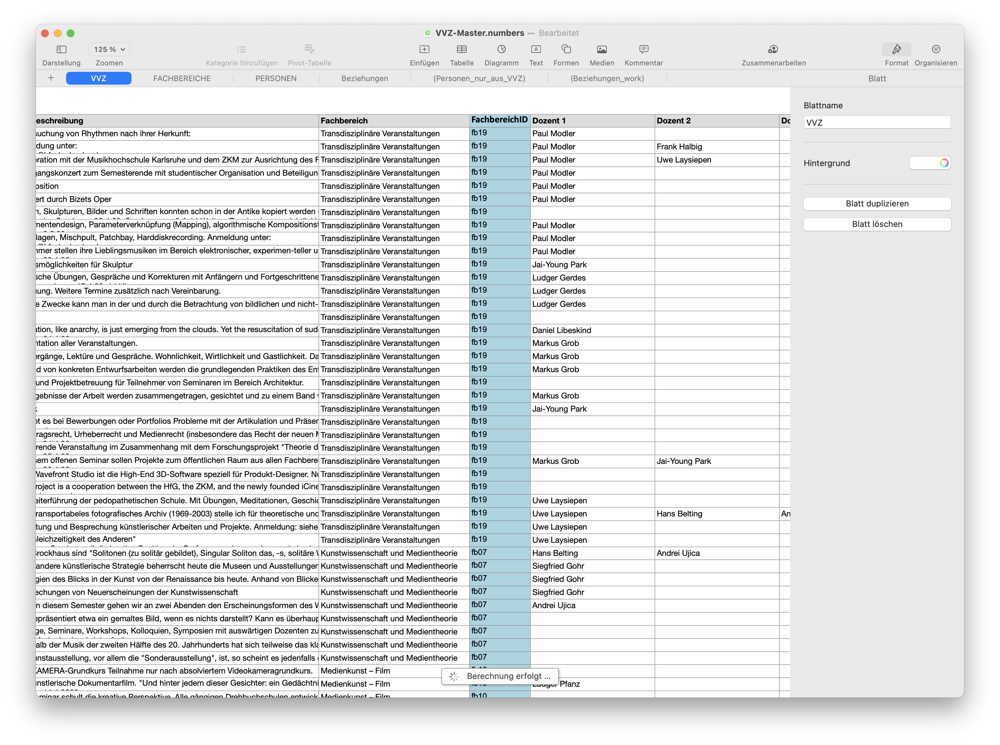
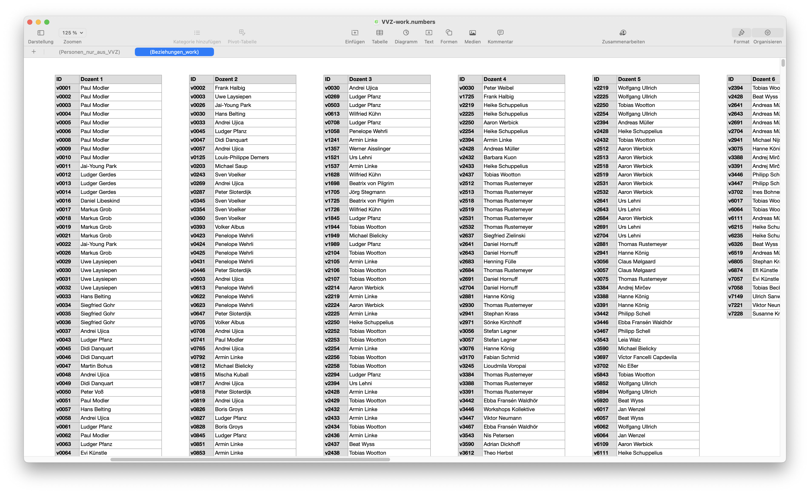
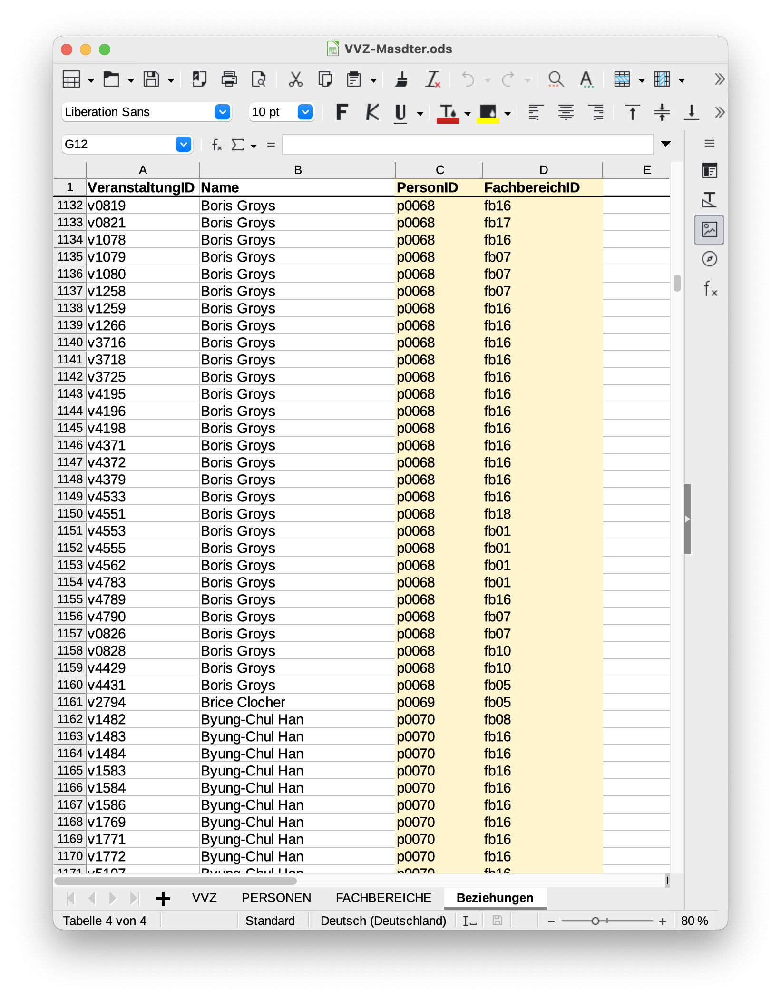

# Daten aufbereiten

Das Aufbereiten der Daten ist extrem wichtig – und zeitaufwendig.  
Nur strukturierte und bereinigte Daten können sinnvoll weiterverarbeitet werden.  

Octoparse (siehe [1. Web scraping](../1-Web-Scraping/)) erzeugt eine Liste wie diese:

Wir hatten die Liste zunächst in Apples "Numbers" geöffnet. Dort wurden die Texte leider verstümmelt, was wir auf die fehlerhafte Zeichencodierung der HTML-Seiten zurückgeführt hatten. Wir dachten, Octoparse hätte das Auslesen bei ungültigen Zeichen abgebrochen. Tatsächlich lagen die Texte jedoch vollständig vor, und zwar inklusive ungültiger Zeichen. Es lag an "Numbers", das die exportierte Liste fehlerhaft öffnete – ohne dies rückzumelden. Mit einer anderen Software wie "OpenOffice" oder "OnlyOffice" geöffnet, trat das Problem nicht auf. 

OnlyOffice stellt die ungültigen Zeichen visuell dar, wodurch sie per `suchen & ersetzen` entfernt werden können. Mühsam! Fehlerhaft codierte Zeichen u.A. für `"`, ` `, `'`, etc.

&nbsp;

## Personen/Namen

**Wichtig:** Die Zeilennummern (inkl. Leerzeilen!) bedeuten die Zuordnung der Person zu einer Veranstaltungen. Diese Information ist grundlegend und darf nicht verloren gehen. Deshalb immer mit Kopien der Hauptliste arbeiten, beispielsweise um zu sortieren oder Duplikate zu entfernen. 

Die ursprüngliche Liste enthält Namen so, wie sie geharvestet wurden. Viele Veranstaltungen haben mehrere Dozent*innen, die als durchgehender String vorliegen. Beispiel: 
> SS2007 | Campfire Talks/ Raus aus der HfG II | "Prof. Michael Bielicky Ludger Pfanz"

&nbsp;

### Strukturierte Daten erzeugen 

Um strukturierte Daten zu erzeugen, brauchen wir 
1. eindeutige Bezeichnungen: "Prof. Michael Bielicky" ist dieselbe Person wie "Michael Bielicky"; manche Personen führen ab einem gewissen Zeitpunkt Doppelnamen; es finden sich unterschiedliche Schreibweisen; etc.
2. jede Person in einer eigenen Zelle

Wir suchen nach Mustern, um möglichst viel durch `suchen & ersetzen` zu lösen.

**OpenOffice**  
1. Neue Mappe anlegen, ursprüngliche Liste duplizieren.  
2. Akademische Titel &rarr; `löschen`  
Suchen nach `"`, `Prof. `, `Dr. `, etc. und ersetzen mit nichts (löschen).  *Damit verlieren wir manche Informationen (wie akademischer Grad). Diese könnten auch in eine neue Spalte kopiert werden. Oder – besser noch – man arbeitet mit einer Referenzdatenbank für Namen und verknüpft mittels Identifier (ID).*
3. Zeilenumbrüche &rarr; `;`  
Um Strings zu trennen erzeugen wir ein eindeutiges Zeichen zwischen Namen. Glücklicher Weise sind in unserer Liste mehrere Dozenten durch einen Zeilenumbruch getrennt. Den Zeilenumbruch können wir durch einen Strichpunkt ersetzen. Dazu verwenden wir *regular expressions* und suchen nach dem Zeichen `\n`.
4. Kommata &rarr; `;` 
5. Nach Klammern suchen `(` und ggf. bei Namen in Klammern wieder `;` &rarr; `,` damit diese Namen nicht getrennt werden.

**Wichtig:** Diese Liste (Personen durch Semikolon getrennt) wird später noch gebraucht &rarr; zwischenspeichern!

In einem neuen Arbeitsblatt wählen wir `Text import` und definieren das Semikolon als Trennzeichen. Dadurch wird pro Zeile jeder Name in eine eigene Spalte geschrieben. 

Diese Spalten können wir dann in die Master-Liste einfügen.  
**Wichtig:** Die Zuordnung der Dozenten zu den Veranstaltungen geschieht über die Zeilennummern. Die neue Liste muss also an die richtige Stelle eingefügt werden: 
1. alle Zeilen und Spalten markieren
2. in der Master-Liste in die erste leere Spalte rechts, oberste Zeile einfügen

&nbsp; 

### Distinke Personen-Liste erzeugen (keine Duplikate)

Wir brauchen eine Liste aller Personen ohne Duplikate. Jede Person bekommt eine eindeutige ID. Später stellen wir so Referenzen zwischen Personen und Veranstaltungen her. Außerdem bietet es sich auch für andere Zwecke an, eine zentrale Personen-Liste mit eindeutigen Identifiern zu führen.

Die Liste, in der die Personen durch Semikolon getrennt sind, dient als Grundlage; alles kopieren und im Editor einfügen.

**SublimeText (Text Editor)**  
`;` &rarr; `\n` (Zeilenumbrüche), um eine eindimensionale Liste zu erzeugen

**OpenOffice**  
Diese Liste sortieren.

**SublimeText**  
Ggf. sortierte Liste bereinigen: Leerzeichen am Wortanfang löschen.

**OpenOffice**  
1. Liste sortieren
2. Distinkte Liste erzeugen (Duplikate löschen)
   
3. Liste ohne Duplikate manuell prüfen:
   - Verschiedene Schreibweisen desselben Namens zusammenführen; eine Haupt-Schreibweise festlegen; Varianten in Spalten neben der Hauptschreibweise dokumentieren.  
   &rarr; Varianten in ursprünglicher Liste suchen und durch Hauptschreibweise ersetzen `suchen & ersetzen`  
   - Sinnlose Einträge wie "N.N.", etc. löschen.  
   &rarr; Sinnlose Einträge in ursprünglicher Liste `suchen & löschen`  
   - Sonstige Ungereimtheiten klären.  
   &rarr; Ungereimtheiten in ursprünglicher Liste `suchen & ersetzen`  
4. Die so entstandene distinkte und eigenständige Personen-Liste mit IDs versehen.

&nbsp;

## Fachbereiche

### Distinkte Liste erzeugen (Duplikate löschen)

### Liste bereinigen
- z.B. Art "Research and Media Philosophy" ist identisch mit  "Kunstwissenschaft und Medienphilosophie"
- den String "Philosophie und Aesthetik (bis SS 2016)" trennen in "Philosophie und Aesthetik" und "bis SS 2016"

Einträge der bereinigten Liste in der "Fachbereich"-Spalte der Master-Liste `suchen & ersetzen`. **Achtung:** NUR in der Spalte "Fachbereiche", nicht in der Seminarbeschreibung etc.

Fehlende Fachbereiche recherchieren und nachtragen.

&nbsp;

## Listen zusammenführen, Beziehungen herstellen

Jeder Knoten, den wir referenzieren wollen, braucht eine **eindeutige ID**.
- Vorlesungen/Veranstaltungen: v0001  
- Personen: p001  
- Fachbereiche: fb01  

### Beziehungen

Excel-Funktion `XVERWEIS` verwenden.  

Formel für die Fachbereiche:  
`XVERWEIS(F2;FACHBEREICHE::Tabelle 1::Name;FACHBEREICHE::Tabelle 1::ID;)`  

### Beziehungen Person-Veranstaltung-Fachbereich

Gegeben ist eine zweidimensionale Beziehung von `Dozenten` und `Veranstaltungen`. Denn jede Veranstaltung kann mehrere Dozenten haben. Ziel ist eine eindimensionale Liste aller Personen, die mit einer Veranstaltung verbunden sind (`IST DOZENT`).  

Diese Liste wird manuell generiert – ein aufwendiger und fehleranfälliger Schritt!

Jede Spalte `Dozenten` mit der Spalte `VeranstaltungID` kopieren. 

Die einzelnen Tabellen zu einer langen, eindimensionalen Tabelle verbinden (jeweils kopieren und am unteren Ende einfügen). Das Resultat ist eine eindimensionale Liste aller Dozenten je Veranstaltung mit der korrespondierenden `VeranstaltungsID`.  

Diese Liste ist die Grundlage der Tabelle `Beziehungen`.  

`PersonID` und `FachbereichID` werden dynamisch erzeugt. Es sind Referenzen auf die Tabellen `VVZ` und `Personen`.

Formel für die `PersonID`:  
`XVERWEIS(B2;PERSONEN::Tabelle 1::Name;PERSONEN::Tabelle 1::ID)`

Formel für die `FachbereichID`:  
`XVERWEIS(A2;VVZ::Tabelle 1::ID;VVZ::Tabelle 1::FachbereichID;)`
