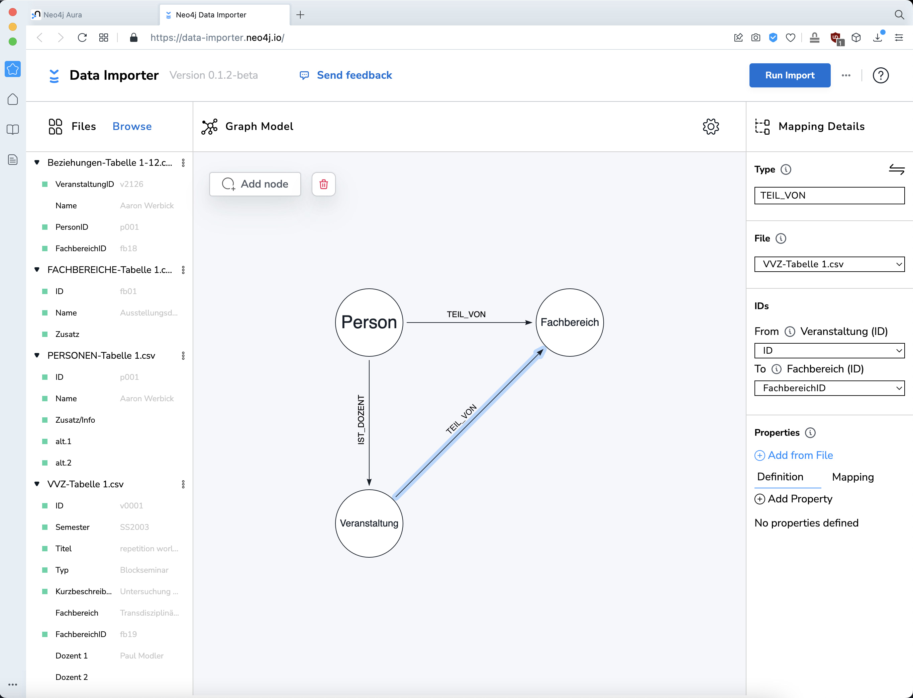
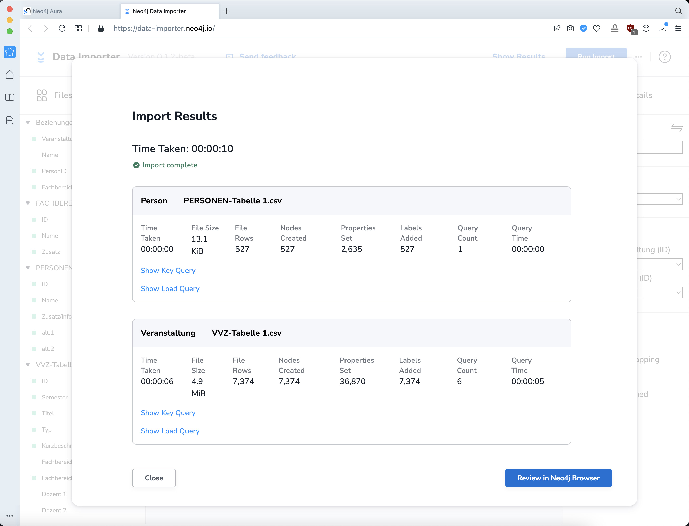

# Strukturierte Daten in Neo4j importieren

Für Datenanalyse arbeiten wir mit einer Graphdatenbank, die einfach und anschaulich (komplexen) Beziehungen zwischen Daten darstellen kann. 

Wir verwenden [Neo4j AuraDB](https://neo4j.com/cloud/platform/aura-graph-database/), einen cloud service mit free plan Option, und importieren unsere Liste. 

Einen Account anlegen und [einloggen](https://console.neo4j.io/).  
Neue Datenbank-Instanz:  
- Instance type: AuraDB (free)
- Instance Name: hfg vvz (in unserem Fall)
- GCP Region: Belgium (europe-west1)
- Starting dataset: Load or create your own data in a blank instance

Im nächsten Schritt wird das Passwort für die Datenbank angezeigt. Es muss abgespeichert werden, weil es später beim Import und jeder anderen Abfrage bzw. Manipulation gebraucht wird.

Neo4j bietet einen Importer an.  
[Youtube-Tutorial](https://youtu.be/vI2XZOf4hVY)

Zunächst definieren wir das Modell. Eine Graphdatenbank besteht aus Nodes und Relations, Knoten und Verbindungen/Kanten. Wir definieren den schematischen Aufbau unserer Datenbank. Sie besteht aus drei `node`-Typen – Veranstaltung, Person, Fachbereich – und den Beziehungen untereinander.

#### Nodes

Mit `Add node` erzeugen wir drei Nodes.

Spätestens jetzt brauchen wir Daten. Als Datenbasis exportieren wir die Master-Liste als `CSV`. Es bietet sich an, für jede Mappe eine eigene Datei zu exportieren. In unserem Fall:

`Beziehungen.csv`  
`Fachbereiche.csv`  
`Personen.csv`  
`VVZ.csv`

Diese Dateien importieren wir per `drag & drop` in die linke Spalte des Neo4j-Importers. Nun sind unsere Daten hier verfügbar. Wir verknüpfen die Nodes mit den jeweiligen Dateien...  

...und wählen die Properties, die wir importieren wollen.  

Wichtig ist, zu definieren, welche Proprty als ID verwendet werden soll, um eindeutige Zuordnungen zu gewährleisten. Zu diesem Zweck hatten wir weiter oben an jede Person eine eindeutige ID vergeben.  

Bei der Node `Veranstaltung` importieren wir nicht alle Properties. Die Tabelle enthält mehr Informationen, als wir an dieser Stelle brauchen:
- `Fachbereich` soll als Relation zur Node "Fachbereich" erzeugt werden (nicht als Property)
- `FachbereichID` wird für eben diese Relation verwendet
- `Dozent 1` etc. soll ebenfalls als Relation entstehen. Die Zuordnung befindet sich in `Beziehungen.csv`

#### Relations

Relationen können einfach mit der Maus gezogen werden. Wir definieren zunächst die Relation `IST DOZENT` zwischen `Personen` &rarr; `Veranstaltungen`. Den Namen dieser Relation vergeben wir möglichst sprechend und einfach. 

Die Zuordnung befindet sich in der Datei `Beziehungen.csv`, die wir bei "File" auswählen. Die eigentliche Zuordnung muss aber noch definiert werden. Dazu wählen wir welche IDs miteinander in Relation gesetzt werden sollen: `From` / `To`. 

Damit ist die erste Relation definiert. Der Relation selbst könnten noch Properties mitgegeben werden, was aber in diesem Fall nicht nötig ist.

Dasselbe wiederholen wir für die `TEIL VON`-Relationen  
`Person` &rarr; `Fachbereich`  
`Veranstaltung` &rarr; `Fachbereich`

Klick auch **Run Import**. Der Importer fragt nach dem Passwort der Datenbank (siehe oben).

Import erfolgreich.

Neo4j bietet zwei Werkzeuge für die Abfrage der Graphdatenbank an, den "Neo4j Browser" und "Bloom". Der "Browser" kann direkt hier gestartet werden.

Eine erste Abfrage:

&nbsp;

&nbsp;

