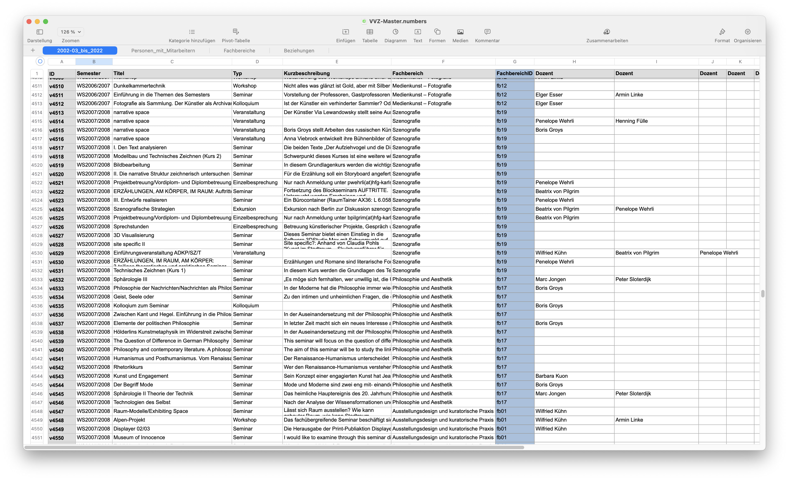

## Unser Ziel
Einen strukturierten Datensatz aus den Vorlesungsverzeichnissen (VVZ) der HfG erzeugen, um die Daten in andere (Datenbank-)Systeme zu importieren. 

Der Workflow beinhaltetr mehrere Schritte:
1. Web Scraping: Daten von Websites automatisiert auslesen und strukturiert in einer Tabelle speichern
2. Daten aufbereiten
3. Daten in Datenbankanwendung importieren, in unserem Fall die Graphdatenbank Neo4j
4. Daten aus gescannten PDFs erzeugen: Texterkennung, Korrektur, Aufbereitung

```mermaid
graph TD
    A(Webpages parsen) -->|Daten exportieren| B(Daten aufbereiten) -->|Daten exportieren| C(Daten importieren/weiterverarbeiten)
    
    D(Texterkennung PDF) -->|Texte kopieren| E(Korrektur) --> F(Daten strukturiert in Tabelle übertragen)
```

