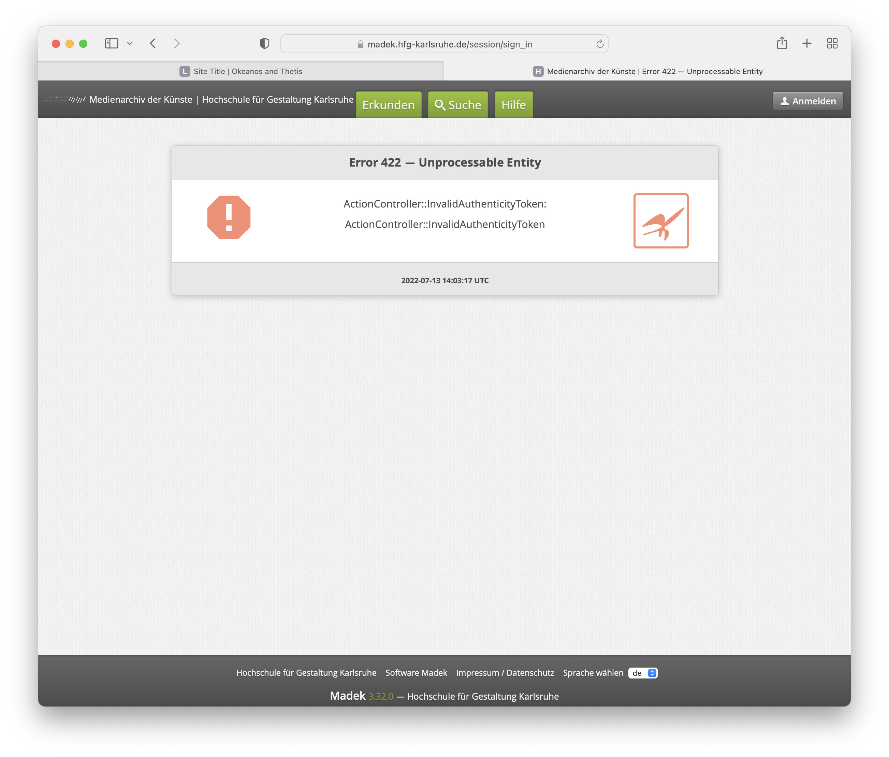

# Madek Entwicklung

Langfristig wollen wir Madek als nachhaltige, community-driven Software etablieren. Darin besteht ein wichtiger Aspekt des Netzwerks mit Partnerinstitutionen, das wir aufbauen.  

Bei der Softwareentwicklung liegt unser Schwerpunkt auf Aspekten der Medienplattform wie user interaction und Modularisierung der Software.  

Unser wichtigstes Ziel ist es, dass die Redaktionsoberfläche (WebApp) flexibel an das System angebunden ist. Dazu soll eine [Input API](#Erweiterung-der-API) (lesen, schreiben, verändern, löschen) entwickelt werden (bzw. eine zusätzliche Kommunikationsschicht zwischen Datenbank und Frontend/WebApp). Über diese können unterschiedliche Interfaces (oder auch Services) mit der Datenbank und dem Dateisystem kommunizieren.  

Nachhaltige Open-Source-Software lebt von guter [Dokumentation](#Dokumentation). Jede neue Entwicklung soll parallel dokumentiert werden.  

Im zweiten Schritt wollen wir (aufbauend auf der Input-API) ein neues [Interface](#Interface-WebApp) für die Redaktionsoberfläche entwickeln.  

&nbsp; 

## Erweiterung der API

:eyes:

#### 1 Backend-Developer oder kleines Team
- functional reactive programming
- SQL
- idealer Weise Studium der Algorithmik
- Ruby on Rails  
- Clojure  
- Aufbau einer API
- Möglichkeit, aktuelle Techniken zu erlernen (Clojure, Ruby on Rails)
- inspirierendes Umfeld Kunst- und Designhochschule

Die im Projekt derzeit wichtigsten Technologien: Relationale DB PostgreSQL, JVM, Clojure, REST und GraphQL, Ruby on Rails (eher legacy status), Ansible, React, ClojureScript mit Reagent.

&nbsp; 

## Dokumentation

Die **technische Dokumentation** richtet sich an Entwickler (technisches Verständnis der Software nötig). 

Die **Anwender-Dokumentation** richtet sich an Studierende und Mitarbeiter\*innen, die mit Madek arbeiten (Verständnis sämtlicher Aspekte der Anwendung von Madek auf der Basis des neuen Interfaces). 

Allgemein setzt das Schreiben einer guten Dokumentation verschiedene Fähigkeiten der Autor*innen voraus:
- klarer und prägnanter Stil
- Fachvokabular
- strukturierter Aufbau
- Sprachkompetenz, besonders bei Nicht-Muttersprachlern bzw. Übersetzungen  

Ggf. wird die technische Dokumentation von den Entwicklern geliefert. Für die User-Dokumentation der Oberfläche suchen wir ein\*e Autor\*in, der/die die Bedienung von Madek anhand der neuen Oberfläche verständlich macht.

:eyes:

#### 1 Technical writer
- detailliertes Verständins der Bedienung von Madek (Redaktionsoberfläche)  

&nbsp;

## Interface WebApp

Die Entwicklung einer neuen Redaktionsoberfläche gliedert sich in zwei Teile: Design und Umsetzung.

**UX/UI Design**  
UX: Architektur der Oberfläche, interaction design, usability, Benutzerfreundlichkeit, etc.  
UI: visuelle Gestaltung der Redaktionsoberfläche (user interface), Layout, Farben, Typographie, etc.

**Frontend-Entwicklung**  
Umsetzung/Programmierung des Designs in einem noch zu definierenden Framework (Vue, React, Svelte, Ruby on Rails, etc.).

:eyes:

#### 1 UX/UI-Designer  
- Erfahrung mit formular-lastigen Interfaces

#### 1 Frontend-Developer  
- *Framework XY*

*oder*  

**Agentur, die beides abdeckt**  
- Erfahrung mit formular-lastigen Interfaces  
- *Framework XY*

&nbsp; 

## Authentifizierung
- LDAP-Anbindung
- oAuth

## Schnittstelle zu anderen Datenbanken
- Normdatenbanken

## Alternative API
- GraphQL

## Medienformate
- Modularisierung
- weitere Medienformate

## Dokumentation erweitern
- allgemeine User-Dokumenation
- konkrete Abläufe beschreiben (Cookbook/How-To)
- REST-API mit Beispielen / code snippets
- Installation (technische Dokumenation)

## Session management neu aufbauen
Beschrieben von Tom Schank am 12.07.2022 als Abhängigkeit in Zusammenhang mit der Input-API.

Möglicherweise im Zusammenhang mit diesem Issue:

