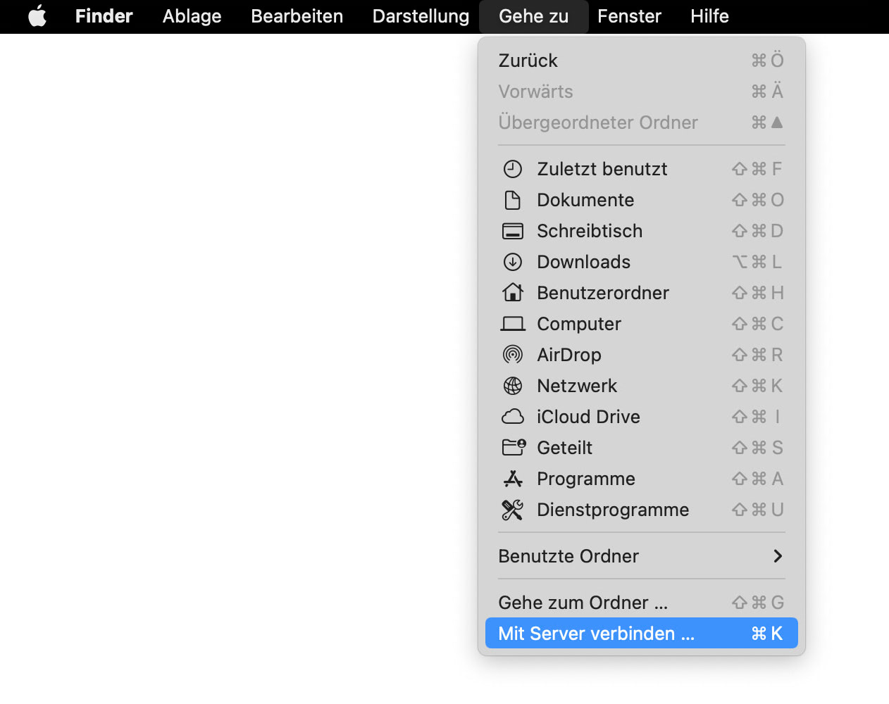
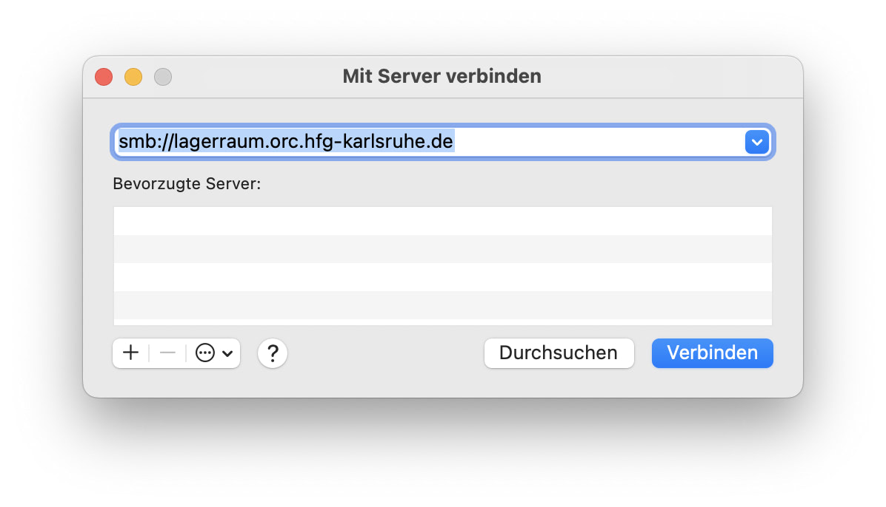
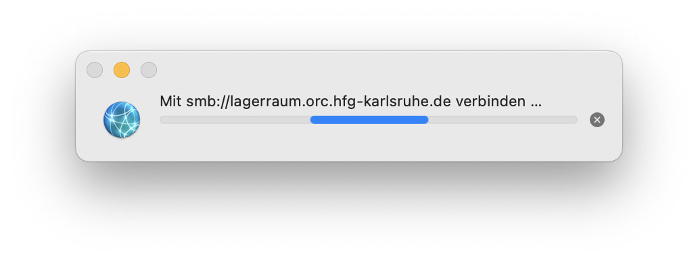
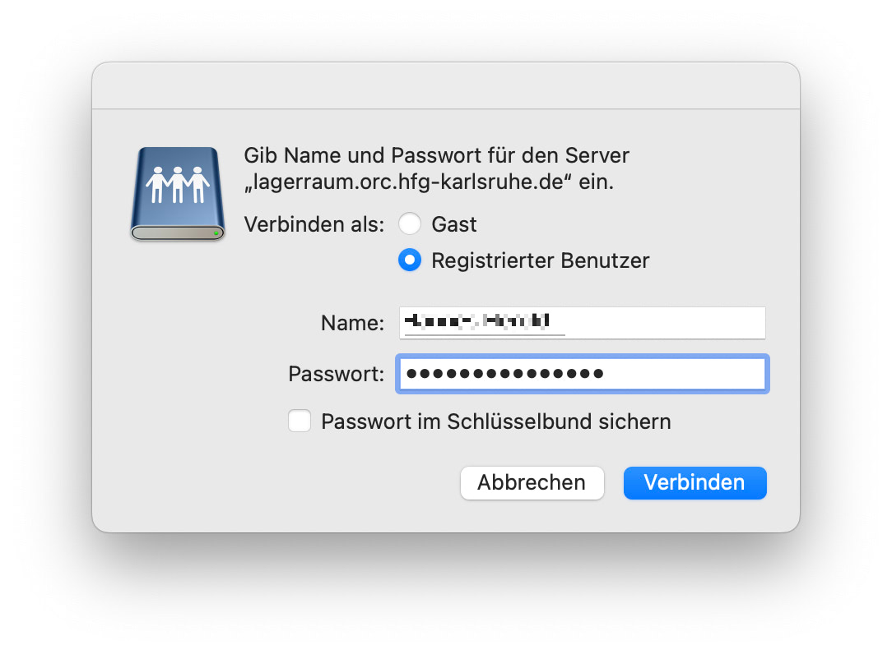
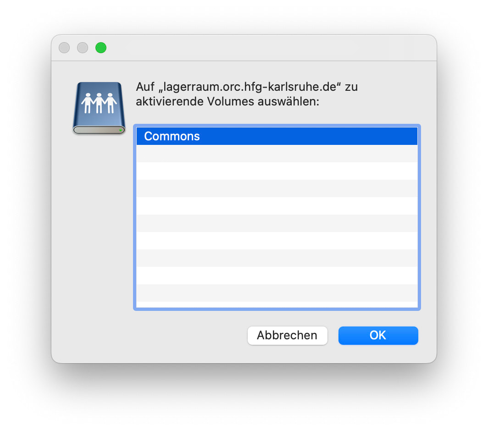
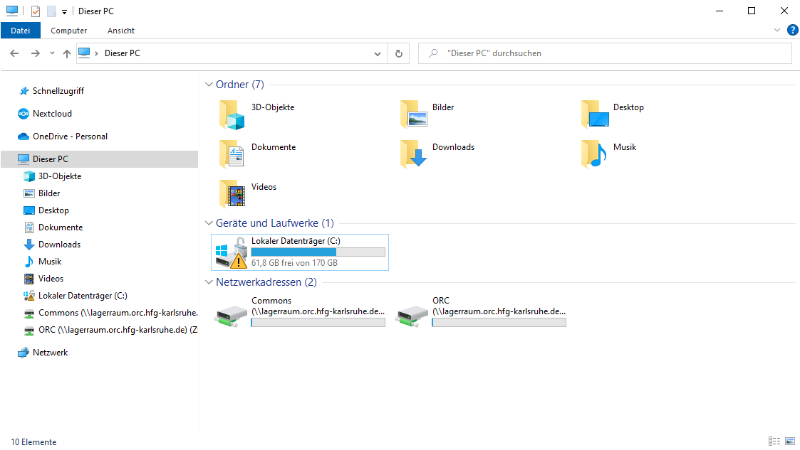
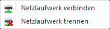
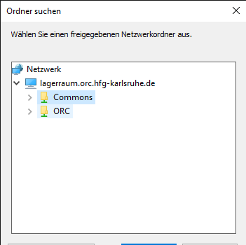
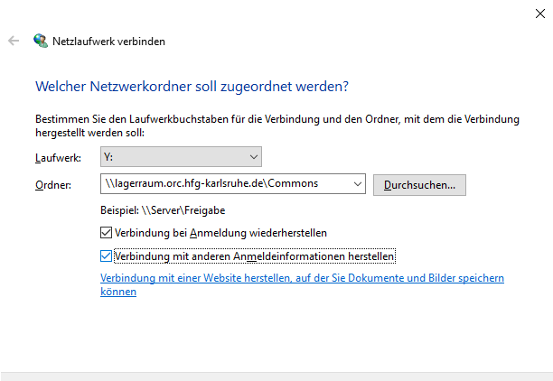
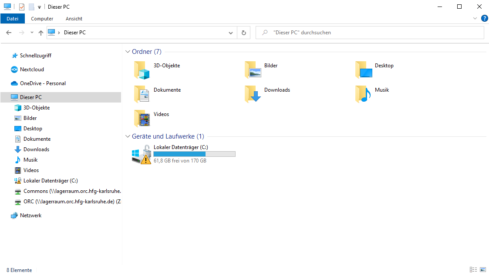

# ORC File Server

The ORC-NAS (Network Attached Storage) is our file storage server. It is intended for use by the labs and the press at HfG Karlsruhe.  

:warning: **Remember**: NAS only works "inside the HfG", if you are connected by cable or through eduroam. :warning:

If you would like to request an account, or encounter any problems, please contact us:  
Víctor Fancelli Capdevilla: [vfcapdevila@hfg-karlsruhe.de](mailto:vfcapdevila@hfg-karlsruhe.de)  
Hannes Herold: [hherold@hfg-karlsruhe.de](mailto:hherold@hfg-karlsruhe.de)

You can configure a direct access for shared folders for:
* [Mac Finder](#mac-finder)
* [Windows Explorer](#windows-explorer)

&nbsp;

## Mac Finder

Launch Finder on your Mac computer.  
Click `Go` and select `Connect to Server` or press `command` + `k`.  

Enter `smb://lagerraum.orc.hfg-karlsruhe.de`.  
Click `Connect` to continue.

The Mac computer tries to establish a connection.

If successful, enter your username and password.  
Click `Connect` to continue.

Select the volumes you want to mount.

Now you should see the ORC NAS listed under the `Locations` section of your Finder window.

Additional information can also be found in the [Synology knowledge center](https://kb.synology.com/en-global/DSM/tutorial/access_nas_from_mac).

&nbsp;

## Windows Explorer
Launch File Explorer and go to `This PC` / `Dieser PC`

On the top bar, click `Computer`, then `Netzlaufberg verbinden` / `Map network drive` and then `Map network drive` (the green one).

Select a letter (don't worry, it's not so important) and then write:
``\\lagerraum.orc.hfg-karlsruhe.de\``

You can click on `Browser` / `Durchsuchen` to check which folders are accessible to you, and click the one you want to connect to, and then `OK`

The Folder path has added the name of the Folder at the end:

``\\lagerraum.orc.hfg-karlsruhe.de\Commons``

- [x] Check ``Reconnect at sign-in`` / ``Verbindung bei Anmeldung wiederherstellen`` and let the other option unchecked

Click ``Finish`` / ``Fertig stellen``

Time for username and password: you've got an E-Mail with them. Remember we don't use Accents, Umlauts etc.

The new device(s) should appear on the bottom of the left panel. You can repeat the process for all the Folders you can access.

  

Additional information can also be found in the [Synology knowledge center](https://kb.synology.com/en-global/DSM/tutorial/How_to_map_shared_folder_Windows_PC).
