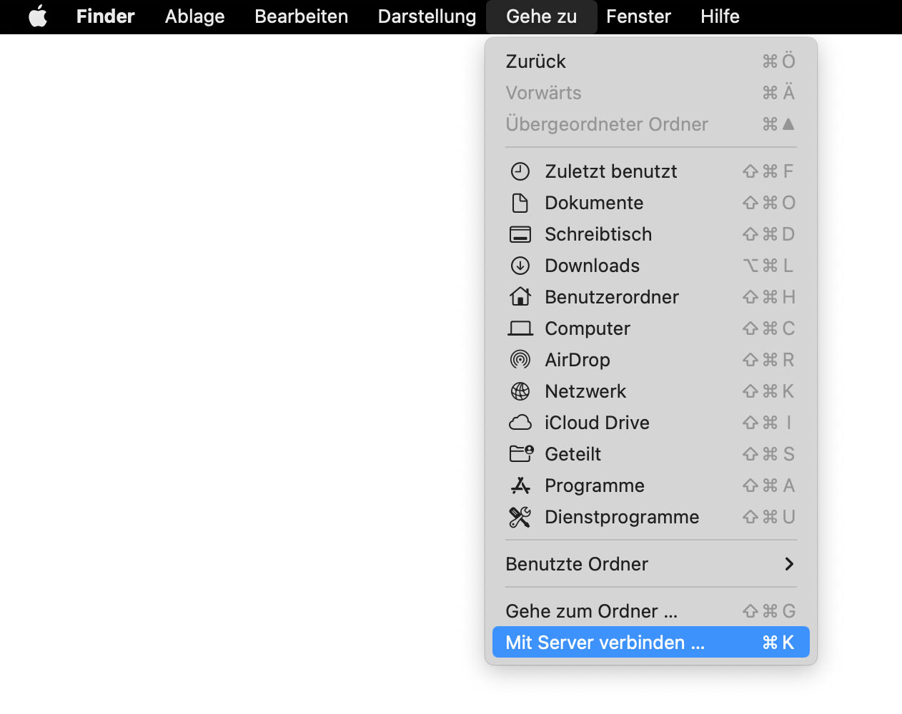

The ORC-NAS (Network Attached Storage) is our file storage server. It's intended for use by the labs and the press at HfG Karlsruhe.  

If you would like to request an account, or encounter any problems, please contact us:  
Víctor Fancelli Capdevilla: [vfcapdevila@hfg-karlsruhe.de](mailto:vfcapdevila@hfg-karlsruhe.de)  
Hannes Herold: [hherold@hfg-karlsruhe.de](mailto:hherold@hfg-karlsruhe.de)

&nbsp;

## Directly access shared folders

### Mac Finder

Launch Finder on your Mac computer.  
Click `Go` and select `Connect to Server` or press `command` + `k`.  

Enter `smb://lagerraum.orc.hfg-karlsruhe.de`.  
Click `Connect` to continue.

The Mac computer tries to establish a connection.

If successful, enter your username and password.  
Click `Connect` to continue.

Select the volumes you want to mount.

Now you should see the ORC NAS listed under the `Locations` section of your Finder window.