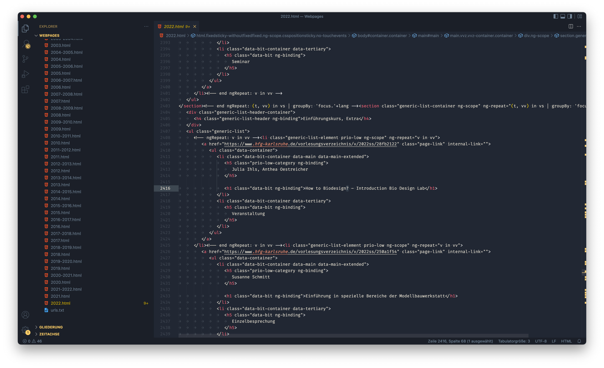

# Web scraping / harvesting
Um Websites austomatisiert auszulesen, kann man entweder ein Tool mit visueller Oberfläche verwenden (Point-and-Click) oder ein Script schreiben (Python).

Für unseren Usecase hat sich die App [Octoparse](https://www.octoparse.com/) als flexibelste und beste Lösung erwiesen (auf MacOS). Man definiert Bereiche und Loop-Abschnitte, die ausgelesen werden sollen. Klick-Automatisierungen und URL-Listen sind möglich.

Das anschließende Aufbereiten der Daten ist extrem wichtig – und zeitaufwendig. Nur strukturierte und bereinigte Daten können sinnvoll weiterverarbeitet werden.

&nbsp;

## Webpages parsen

Wir haben uns entschieden, die einzelnen Seiten je Semester herunterzuladen und lokal auszulesen. Dadurch sind die Ladezeiten kürzer. Außerdem können ungültige Zeichen das Auslesen durcheinander bringen. In unserem Fall hat Octoparse deswegen einige Titel von Veranstaltungen unvollständig ausgelesen. In Schritt 2 (s.u.) bereinigen wir den Code der heruntergeladenen Seiten. 

Hinzu kommt, dass die HfG-Website das Vorlesungsverzeichnis per AJAX lädt. Octoparse kann damit zwar grundsätzlich umgehen, aber die Seitennavigation hat den Ablauf trotzdem unnötig verkompliziert.

### Seiten herunterladen 

Wir haben also alle Semester aus dem [Online-VVZ](https://www.hfg-karlsruhe.de/vorlesungsverzeichnis/) als einzelne Seiten heruntergeladen ("Speichern unter..." im Browser).

### Optional: HTML Code säubern

Die Texte auf den Seiten enthalten ungültige Zeichen, vermutlich ist die Zeichencodierung der HTML-Seiten unsauber. Zunächst dachten wir, Octoparse würde deshalb das Auslesen in bestimmte Felder abbrechen.  

Zunächst hatten wir die ungültigen Zeichen aus den heruntergeladenen HTML-Seiten entfernt (`suchen & ersetzen`, VSCodium). 

Später hat sich herausgestellt, dass die Texte durchaus vollständig ausgelesen wurden, es jedoch zu einem Fehler beim Öffnen der exportierten Liste gekommen war (siehe unten).

### Lokale HTML-Seiten im Browser zugänglich machen

Octoparse liest Seiten über HTTP aus. Wir haben die lokalen HTML-Seiten über die lokale Serverumgebung [Laravel Valet](https://laravel.com/docs/9.x/valet) verfügbar gemacht (MacOS). Alternative Software: XAMPP MAMP.

### Octoparse: Liste der URLs anlegen und eintragen

Aus den heruntergeladenen Seiten haben wir eine Liste aller lokalen http-Adressen erzeugt.

### Octoparse: Abschnitte definieren, die ausgelesen werden sollen

Hier beginnt die eigentliche Arbeit beim harvesten. Es ist eine komplizierte Sache und kann recht langwierig sein, abhängig vom Website-Layout. In unserem war die Zuordnung der Fachbereiche zu den Veranstaltungen besonders kompliziert. Im Template wird jeder Fachbereich als gruppiert ausgegeben, wobei der Name des Fachbereichs nur einmal als Titel der Section erscheint. Dadurch ist ein einfacher Loop nicht möglich. Letztendlich liest das Skript nun den Fachbereich von der Detailseite aus, wo er glücklicher Weise auch ausgegeben wird – nur nicht im Sommersemester 2022. Die Fehlstellen mussten manuell nachgetragen werden.

### Octoparse: Script starten

Weil die Seminarbeschreibungen online abgerufen werden, dauert der Prozess sehr lange. Nur die lokalen Seiten auszulesen, geht deutlich schneller.

&nbsp;

## Daten exportieren

Octoparse bietet die Möglichkeit, Duplikate automatisch zu entfernen.  

Die Daten müssen lokal gespeichert werden. Die Software bietet verschiedene Formate an (CSV, XLSX, etc.). Für uns hat sich XLSX am besten geeignet. Der CSV-Export war leider unbrauchbar.
