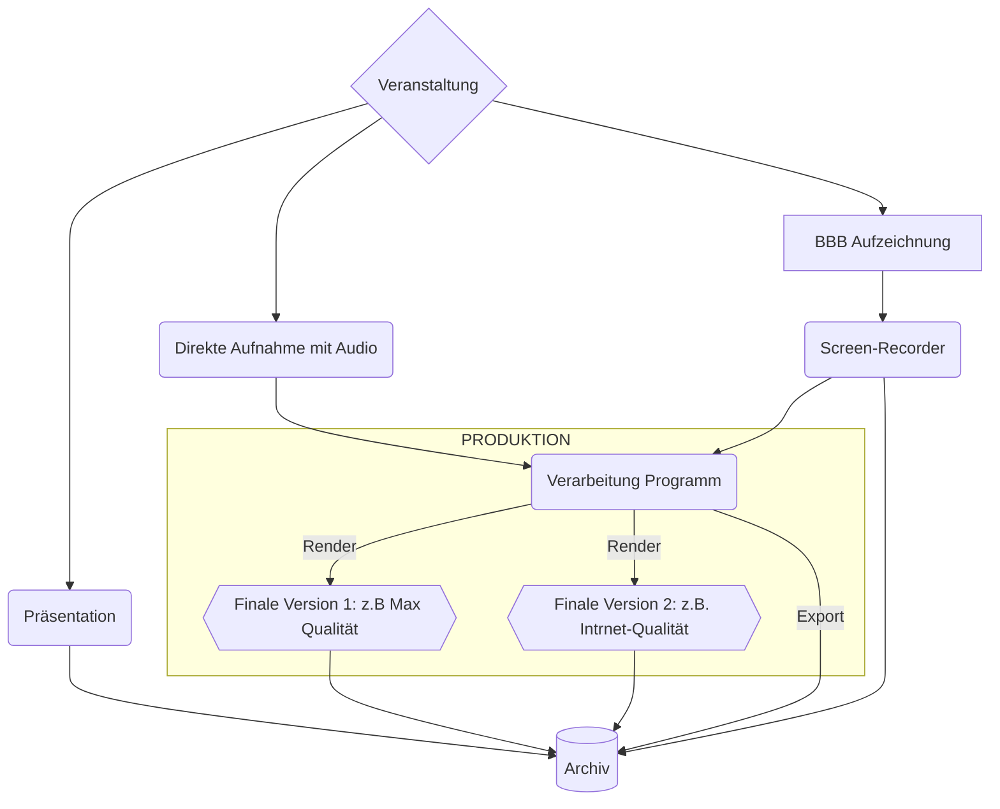

# Videokonferenz 

&nbsp;

## Vorüberlegungen

Videokonferenzen sind ein Kompromiss zwischen Qualität und Durchfluss: je mehr (Bild)Qualität, desto dichter die Verbindung und schlechter die User-Erfahrung. Deswegen, wenn möglich, ist besser, die Videokonferenzaufnahme und die Videokonferenz separat zu betrachten.

&nbsp;

## Videokonferenz (Hybrid)
Hybride Videokonferenzen sind der komplexere Fall. Grundideen sind:

 > Je weniger Kameras und Mikrofone, desto mehr Qualität und Durchfluss. Streaming (nur ein Sender\*in, viele Empfänger\*innen) sollte auch berücksichtigt werden.

 > Je stabiler die Verbindung, desto besser: Immer mit Ethernet-Kabel, gute Rechner usw. arbeiten, mindestens für die Hauptsender.

Es gibt (tendenziell) drei Fokus in eine Videokonferenz:
  1. Die vortragenden Personen (reich normalerweise eine Fix-Kamera; Ton ist hier sehr wichtig)
  2. Die Präsentation der vortragenden Personen: es sollte für _in situ_ und fern Publikum sichtbar sein. Am besten immer eine PDF-Kopie dabei haben. Es gibt auch hier verschieden Möglichkeiten
   * Man kann das PDF auf BBB hochladen und zeigt sie am Präsenz-Bildschirm. Das ist für die Organisation das praktische.
   * Bildschirm Teilen: nicht so effizient für die Verbindung, aber eventuell bequemer für die vortragende Person. Falls sie ein eigenes Laptop mitbringt, immer Fragen **was für ein Anschluss hat**: VGA, HDMI oder DisplayPort (normal, mini, micro), USB-C usw. In diesem Fall verbindet die Person selber mit BBB als Moderator und teilt die Präsentation.
   * Alternativ könnte man auch die Haupt-Kamera so einstellt, dass man auch die Präsentation (z.B. hinter die vortragende Person) sieht. Problem hier ist, dass Text könnte zu klein sein, um verständlich zu werden. 
  3. Das Publikum: Man bekommt ein besserer Eindruck der Veranstaltung, wenn man Publikum sieht, insbesondere beim Fragen. Das Problem hier ist, dass jeder Person sollte Erlaubnis für die Aufzeichnung (schriftlich) geben, falls sie veröffentlicht werden soll. Am besten ist, wenn die Haupt-Kamera so eingestellt ist, dass nur ein Teil des Publikums aufnimmt und erklärt dieser Unterschied (mit Plakat/Zeichnung oder kurz bevor der Vortrag). Am Q & A sollte man das erinnern, besonders für Ton (aber auch für das Bild): Eine Idee wäre 2 Fix-Mikrofone haben, eine im Bild und die andere nicht.

&nbsp;

## Dokumentation einer Videokonferenz

Das übliche Format für Konferenzen wäre Video und falls gewünscht die Präsentation. Videokonferenzen aber enthalten weitere Informationen, deswegen könnten ein bisschen Montage brauchen.

BBB erlaubt eine Session zu speichern, mit Nachrichten auf dem Chat, die Präsentation und alle die Kameras, die öffnen sind, und alles sogar synchronisiert. Problem ist, dass alles in einem eigenen System mit eigenem Format in Server gespeichert wird. Da die Datei groß sind, sollte man nur aus Zwischenlösung nutzen. Man kann dazu ein Screen-Recorder nutzen, um von der Plattform die Videos "herunterladen" (am besten, mit maximal Qualität). In diesen Fall, der Screen-Recorder ist unsere Original-File(s) und geht direkt im Archiv. Falls man sie verarbeitet, sollte man am besten:
  * Ein Export machen und diese im Archiv speichern (sodass man wieder direkt verarbeiten kann).
  * Die Ende-Version(en), in gute Qualität und in andere Qualitäten.

