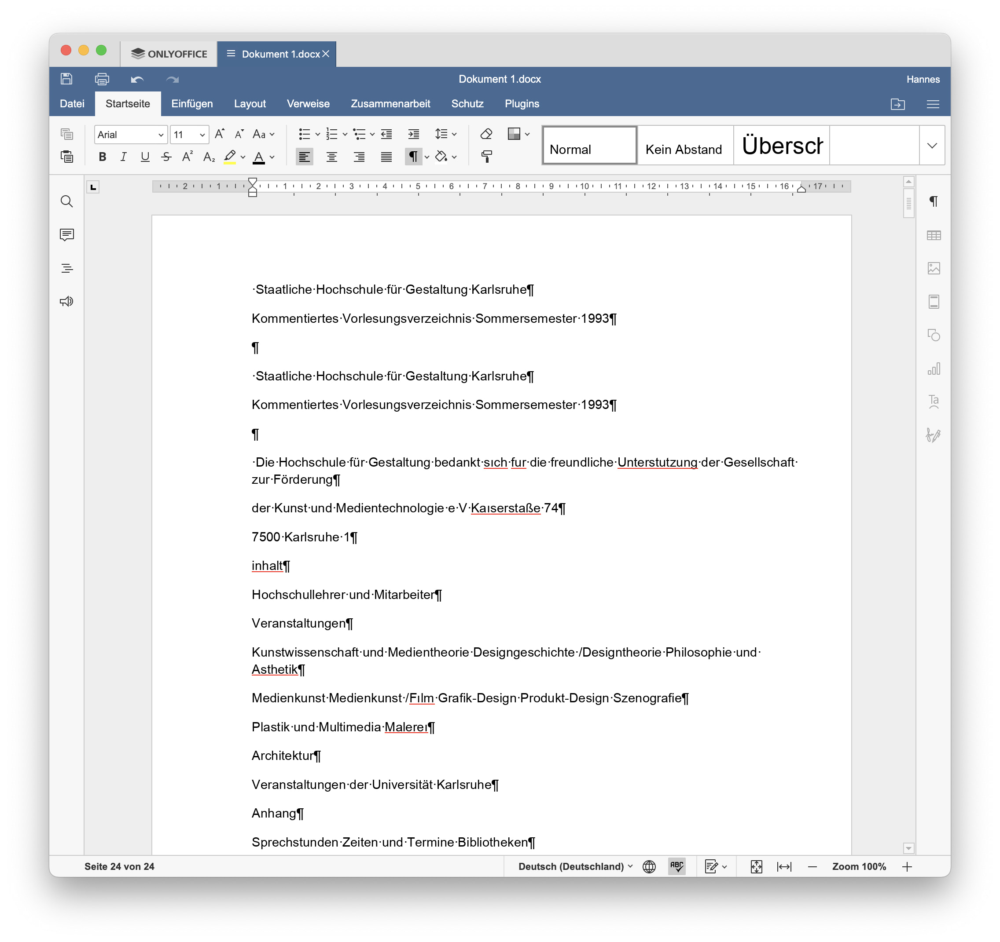
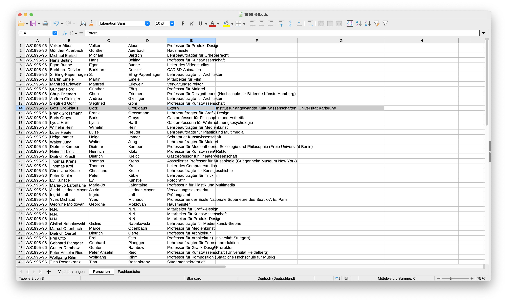
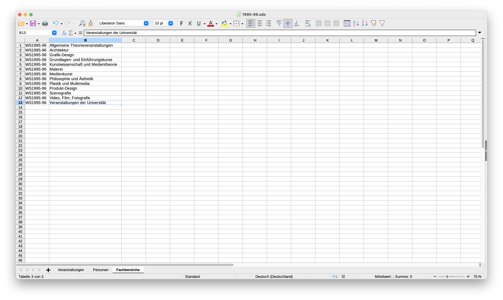

# Texte aus gescannten Bildern extrahieren und strukturieren

&nbsp;

## Typen von Texterkennung

1. OCR: Optical Character Recognition  
Klassische Texterkennung
2. IRC: Intelligent Character Recognition  
Regel- und layoutbasierte OCR-Software
3. IDP:  Intelligent Document Processing
OCR-Software mit künstlicher Intelligenz. Meist Kombinationen aus maschinellem Lernen, Deep Learning, Optical Character Recognition (OCR) und Natural Language Processing (NLP).

### ORC Tools

#### PDF24 Tools (online)
https://tools.pdf24.org/de/pdf-text-erkennen  
- in unserem Fall erstaunlicher Weise die besten Ergebnisse

#### CEB doXiview (online)
https://ocr.team/  

- Texterkennung (OCR) auf Basis von neuronalen Netzen. Frauenhofer Institut und CIB deepER.  
- CIB deepER engine oder [Tesseract](https://github.com/tesseract-ocr/tesseract)
- Korrekturen innerhalb der Anwendung möglich
- _leider ist der kopierte Text nicht zu gebrauchen, weil das Layout nicht erkannt wird_

#### ORCmyPDF (command line)
https://ocrmypdf.readthedocs.io/  
- verwendet [Tesseract](https://github.com/tesseract-ocr/tesseract) für OCR
- [NextCloud-Plugin](https://github.com/janis91/ocr) verfügbar

#### Dangerzone (offline)
https://dangerzone.rocks/  

### IDP Tools

#### Nanonets (online, payed service)
https://nanonets.com/  
- define a model, train the algorithm, run extraction, download data. [Supported languages](https://support.nanonets.com/hc/en-us/articles/4402102692241-What-are-the-languages-supported-recognised-by-Nanonets-apart-from-english-)  
- _Ergebnisse nicht überzeugend:_ Training funktioniert nicht, keine Texterkennung, Layout wird nicht erkannt

&nbsp;

### Maschinell erkannten Text aufbereiten

Erkannten Text aus dem PDF kopieren und in ein Textverarbeitungsprogramm einfügen. Dabei **Formatierungen entfernen**, um reinen Text zu erhalten.

#### Texte korrigieren

Prinzipiell muss der automatisch erkannte Text beim Übertragen in die Liste manuell geprüft werden. Es kommt immer wieder vor, dass das OCR-Programm Zeichen falsch erkennt. Außerdem wollen wir keine Wörter mit Silbentrennung.  

Es hilft, die Steuerzeichen im Textverarbeitungsprogramm einzuschalten.  

Wir empfehlen, bestimmte Zeichen automatisch im ganzen Dokument zu ersetzen:

- Silben-Trennzeichen: Suche nach "-&nbsp;" (`Minus` `Leerzeichen`).  
:point_right: Dabei entstehen Fehler, z.B. "Text- und Bilderkennung" wird zu "Textund Bilderkennung". Solche Fälle müssen beim Übertragen in die Liste wieder korrigiert werden. 
- Typografische Anführungszeichen `„` `“` &rarr; ersetzen durch `"`
- Falsch erkannten Buchstaben/Worte, sofern sie sich wiederholen (z.B. `fur` statt `für` oder `ı` statt `i`, etc.)
- ggf. Tabulatoren &rarr; ersetzen durch Leerzeichen
- falsche Zeilenumbrüche entfernen

&nbsp;

### Korrigierte Texte in die Liste eintragen

:point_right: Immer reinen Text ohne Formatierungen in die Liste eintragen.

1. Informationen in die entsprechenden Spalten einfügen:  
   - Semester  
   - Fachbereich  
   - Name Dozent(en)  
   - Titel  
   - Kurzbeschreibung 
   - ggf. weitere Felder

Wir haben unsere Liste so aufgebaut, dass sie eine eigenständige Personen-Liste enthält und die Nachnamen automatisch zu vollen Namen ergänzt.  

XVERWEIS (Excel, Numbers):  
`XVERWEIS(F20;Personen::Nachname;Name;"";Übereinstimmungstyp;Suchtyp)`

VERGLEICH (LibreOffice, höhere Kompatibilität):  
`=WENNNV(INDEX($Personen.B:$Personen.B;VERGLEICH(I72;$Personen.D:$Personen.D));"")`
- Die Personen-Liste können wir später mir der Master-Personen-Liste abgleichen.  
- Im PDF-VVZ stehen nur die Nachnamen, für den Import benötigen wir aber die vollen Namen.  
- Jeder Name bekommt eine eigenen Spalte. Auch das ist schon die Vorbereitung für den späteren Import.

:exclamation: Wenn `VERGLEICH` verwendet wird, muss die Liste, in der gesucht wird, alphabetisch geordnet sein.

&nbsp;

### Personen-Liste erzeugen

&nbsp;

### Fachbereiche-Liste

Dasselbe für die Fachbereiche, wie sie im VVZ abgedruckt sind.

