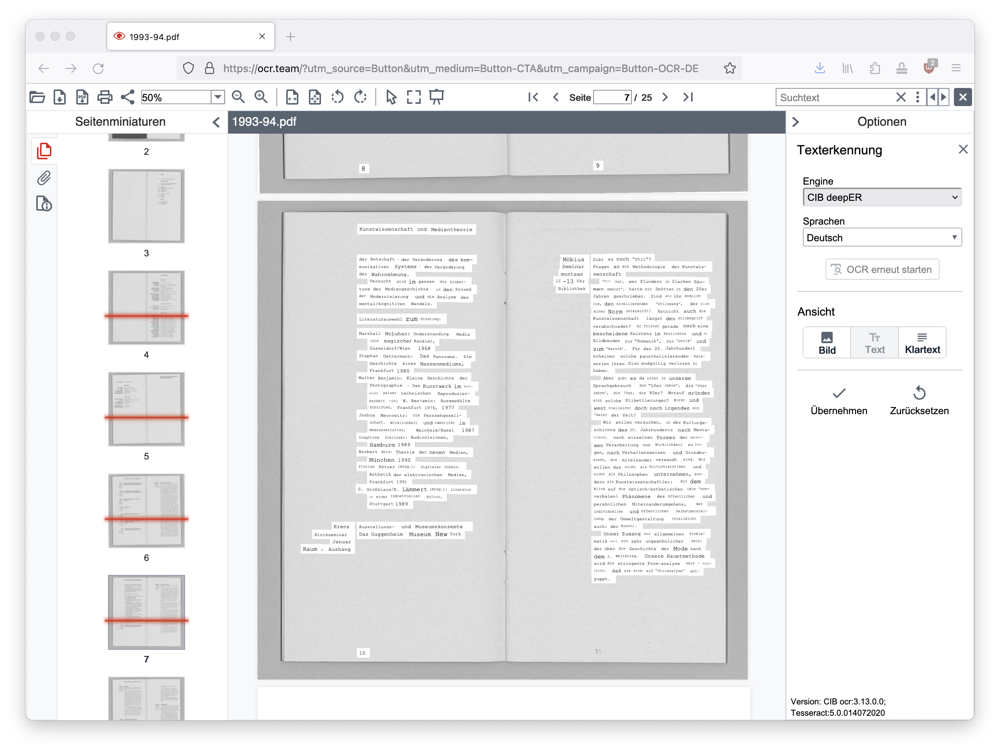
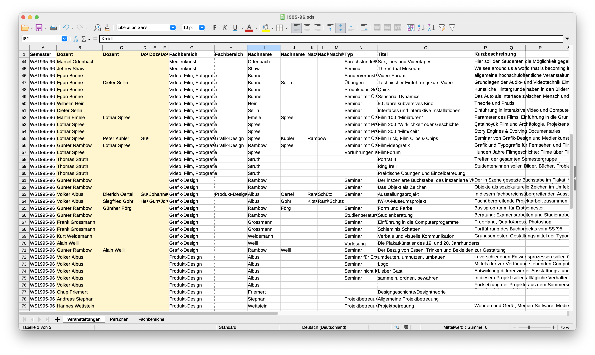

# Texte aus gescannten Bildern extrahieren und strukturieren

&nbsp;

## Typen von Texterkennung

1. OCR: Optical Character Recognition  
Klassische Texterkennung
2. IRC: Intelligent Character Recognition  
Regel- und layoutbasierte OCR-Software
3. IDP:  Intelligent Document Processing
OCR-Software mit künstlicher Intelligenz. Meist Kombinationen aus maschinellem Lernen, Deep Learning, Optical Character Recognition (OCR) und Natural Language Processing (NLP).

### ORC Tools

#### PDF24 Tools (online)
https://tools.pdf24.org/de/pdf-text-erkennen  
- in unserem Fall erstaunlicher Weise die besten Ergebnisse

#### CEB doXiview (online)
https://ocr.team/  

- Texterkennung (OCR) auf Basis von neuronalen Netzen. Frauenhofer Institut und CIB deepER.  
- CIB deepER engine oder [Tesseract](https://github.com/tesseract-ocr/tesseract)
- Korrekturen innerhalb der Anwendung möglich
- _leider ist der kopierte Text nicht zu gebrauchen, weil das Layout nicht erkannt wird_

#### ORCmyPDF (command line)
https://ocrmypdf.readthedocs.io/  
- verwendet [Tesseract](https://github.com/tesseract-ocr/tesseract) für OCR
- [NextCloud-Plugin](https://github.com/janis91/ocr) verfügbar

#### Dangerzone (offline)
https://dangerzone.rocks/  

### IDP Tools

#### Nanonets (online, payed service)
https://nanonets.com/  
- define a model, train the algorithm, run extraction, download data. [Supported languages](https://support.nanonets.com/hc/en-us/articles/4402102692241-What-are-the-languages-supported-recognised-by-Nanonets-apart-from-english-)  
- _Ergebnisse nicht überzeugend:_ Training funktioniert nicht, keine Texterkennung, Layout wird nicht erkannt

&nbsp;

### OCR-Text kopieren und in Textverarbeitungsprogramm einfügen

#### Texte korrigieren

Steuerzeichen im Textverarbeitungsprogramm einschalten
Semi-automatische Korrektur des gesamten Textes:
- Formatierungen entfernen / reinen Text in die Liste eintragen
- typografische Anführungszeichen `„` `“` mit `"` ersetzen
- Wort-Trennzeichen entfernen, am besten mit Suche nach "-&nbsp;" (`Minus` `Leerzeichen`) und manueller Prüfung jedes Fundes, um korrekte Fundstellen zu belassen
- suchen & ersetzen von falsch erkannten Buchstaben/Worte, sofern sie sich wiederholen (`fur` statt `für` oder `ı` statt `i`, etc.)
- ggf. Tabulatoren durch Leerzeichen ersetzen
- falsche Zeilenumbrüche entfernen
- Text komplett korrekturlesen und mit gescanntem PDF-VVZ vergleichen

&nbsp;

### Korrigierte Texte in die Liste eintragen
- Formatierungen entfernen / reinen Text in die Liste eintragen
- Informationen in die entsprechenden Spalten einfügen:  
Semester  
Fachbereich  
Name Dozent(en)  
Titel  
Kurzbeschreibung 

Wir haben die Liste so aufgebaut, dass sie eine eigenständige Personen-Liste enthält und die Nachnamen automatisch zu vollen Namen ergänzt:  
`XVERWEIS(F20;Personen::Nachname;Name;"";Übereinstimmungstyp;Suchtyp)`

- Die Personen-Liste können wir später mir der Master-Personen-Liste abgleichen.  
- Im PDF-VVZ stehen nur die Nachnamen, für den Import benötigen wir aber die vollen Namen.  
- Jeder Name bekommt eine eigenen Spalte. Auch das ist schon die Vorbereitung für den späteren Import.

&nbsp;

### Personen-Liste erzeugen

&nbsp;

### Fachbereiche-Liste

Dasselbe für die Fachbereiche, wie sie im VVZ abgedruckt sind.

